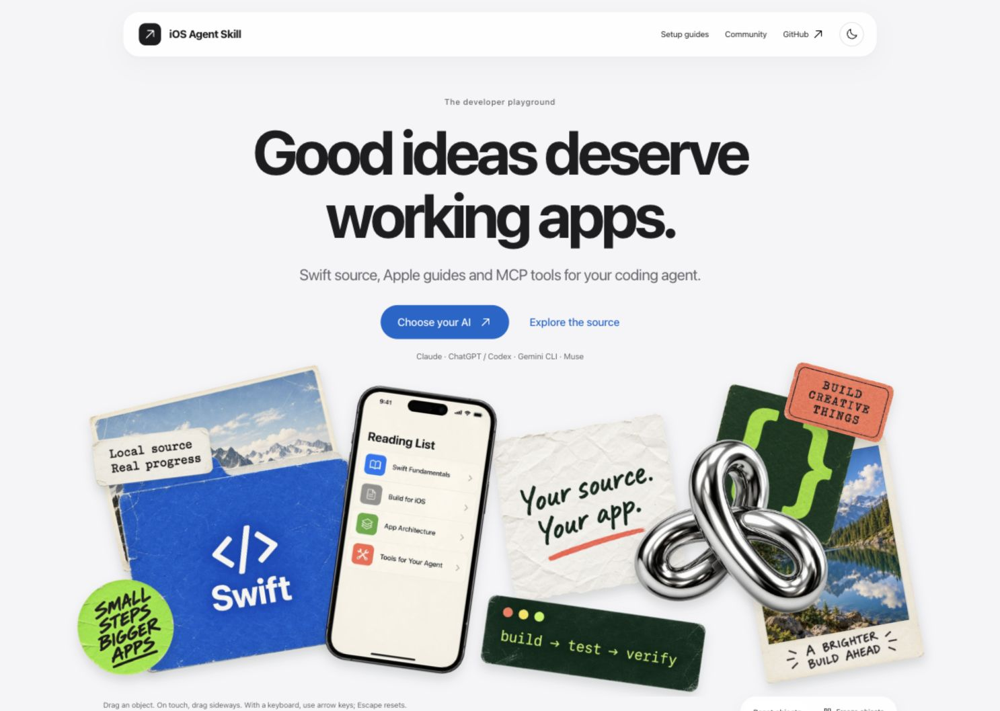
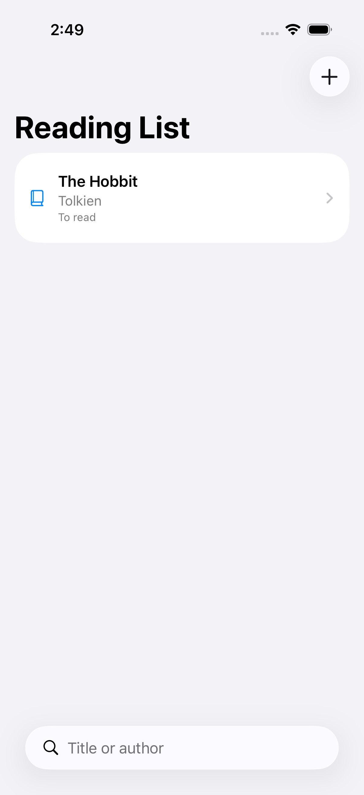

# iOS Agent Skill

**Give your coding agent the Apple references, Swift source and local tools it needs to build and review an iOS app.**

[](https://nagarjuna2997.github.io/ios-agent-skill/)

[Watch the website walkthrough](site/assets/readme-walkthrough.gif) · [Explore the website](https://nagarjuna2997.github.io/ios-agent-skill/)

Use it to turn an app idea into an editable starter, improve an existing Swift project, and check the result with Xcode and the simulator. Your agent writes the app; this repository supplies reusable implementation guidance and tools to inspect its work.

[](https://github.com/Nagarjuna2997/ios-agent-skill/actions/workflows/tests.yml)
[](https://github.com/Nagarjuna2997/ios-agent-skill/actions/workflows/docs-consistency.yml)
[](https://nagarjuna2997.github.io/ios-agent-skill/npm-downloads-details.json)

[Explore the website](https://nagarjuna2997.github.io/ios-agent-skill/) · [Client setup guides](https://nagarjuna2997.github.io/ios-agent-skill/install.html) · [npm](https://www.npmjs.com/package/ios-agent-mcp) · [Release notes](CHANGELOG.md)

## Start with one connection

For Claude Code:

```sh
claude mcp add ios-agent -- npx -y ios-agent-mcp@latest
```

[Set up ChatGPT/Codex, Gemini CLI or Muse](https://nagarjuna2997.github.io/ios-agent-skill/install.html). One npm package includes reviews, local references, app scaffolding and simulator tools. Node.js 20+ is required; building and running iOS apps needs macOS and Xcode.

Then ask:

> Build a SwiftUI reading list with local persistence, search and accessible empty/error states. Reuse the local source library. Build it, run the tests and capture simulator evidence. Explain any checks that fail.

For an existing app, provide its absolute project path and ask for a focused review before making changes.

## What it helps you do

<!-- product-features:start -->
| Feature | What you get |
|---|---|
| Start an app | An editable Swift starter, implementation brief and optional XcodeGen specification. |
| Reuse Apple knowledge | Search local Swift source and guides in bounded sections, plus a dated directory of Apple technologies and release notes. |
| Review Swift code | File-located findings for concurrency, architecture, SwiftUI, availability, security, performance and App Intents. |
| Generate design assets | Named light/dark/high-contrast colors and an opaque 1024px app icon rendered locally from editable SVG layers. |
| Verify on a simulator | Build, test, install, launch and capture screenshots through Xcode. |
<!-- product-features:end -->

[Asset generation](docs/design/asset-generation.md) · [Review tools](docs/mcp/tools.md) · [Simulator setup](docs/tooling/ios-simulator-mcp.md) · [Apple release status](docs/apple/ios-27-release-verification.md)

Create a starter directly:

```sh
npx -y ios-agent-mcp@latest new MyApp --brief "A reading list with local storage" --xcodegen
```

XcodeGen is needed to generate the Xcode project. The starter is not a finished app. Generated app ownership and branding belong to the user.

## See the evidence

The [Reading List demo](samples/ReadingList/README.md) has persistence, search, simulator acceptance tests and captured screens.

<a href="examples/reading-list/library.png">
  
</a>

The server exposes 36 tools. Static reviews are heuristics, not compiler diagnostics. The Apple directory is a reference map, not Apple's proprietary framework source or proof of 405 working integrations. Token savings have not been benchmarked. [Build-loop verification limits](docs/tooling/app-building-loop.md).

## Why use this alongside Xcode?

Xcode already ships agent expertise and build/test tools. Use those when they meet your needs. This repository adds shared guidance across these four client families, inspectable review rules, local source retrieval and repeatable asset workflows. It has not been established that it makes an AI outperform Xcode's skills or use fewer tokens.

[Where the guidance comes from, evidence and unfinished work](docs/evidence-and-scope.md). A paired Claude/Codex benchmark is running; results will be published without assuming a win.

## Help improve the tools

Failure feedback belongs in your coding session: the observed error, the proposed fix and actual verification results. The source server adds troubleshooting guidance to returned tool errors; agent instructions also cover compiler/test failures. These messages do not appear in the app you are building.

`prepare_issue_report` lets your AI prepare a local report when an iOS Agent tool fails. It accepts fixed categories only, shows a preview and a duplicate-search link, and leaves public submission to you. No app source or logs are collected. [Reporting workflow](docs/tooling/issue-reporting.md).

## Four client families, one project

| Client | Setup and evidence |
|---|---|
| Claude | Local MCP and source skill; your Claude client supplies the coding agent. |
| ChatGPT / Codex | Codex local MCP; ChatGPT skills package or a separately configured HTTPS/private-tunnel MCP connection. Availability depends on account/workspace policy. |
| Gemini CLI | Extension configuration and local MCP connection verified. |
| Muse Code | Skill discovery, 36-tool MCP discovery and a Stop hook verified; model sessions and observer behavior remain unverified. |

The project focuses on these four families. For another client, [open a client-support request](https://github.com/Nagarjuna2997/ios-agent-skill/issues/new?template=client_support.md) or add a 👍 to an existing request. Votes inform priorities alongside feasibility and testing; they do not guarantee delivery. Existing experimental adapters are not actively maintained.

`install.sh` is optional: it installs source guidance for a chosen local client, not the MCP server or a browser plugin. Run `bash install.sh --help` after cloning. Most users should use the client setup guide above.

<details>
<summary>Reference coverage</summary>

<!-- apple-catalog:start -->
Apple catalog tracked: **99** technologies. Covered: **99**. Planned: **0**. Skipped: **0**. Deprecated: **0**. Coverage: **100.0%**.

Source of truth: [`frameworks.json`](frameworks.json). Human index: [`docs/apple-framework-index.md`](docs/apple-framework-index.md).
<!-- apple-catalog:end -->

Coverage counts describe documentation, not compiled integrations. Download counts refresh daily and are not unique users.
</details>

[Contributing](CONTRIBUTING.md) · [Development](docs/development.md) · [Security](SECURITY.md) · [Roadmap](ROADMAP.md) · [MIT license](LICENSE)
