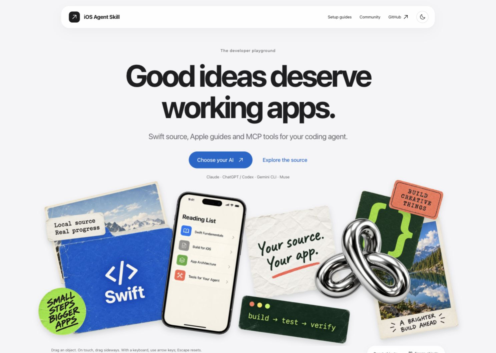
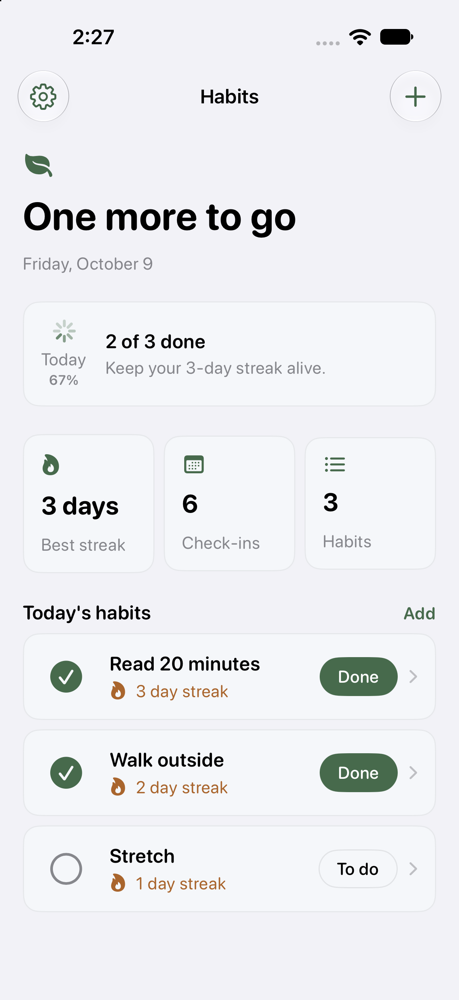
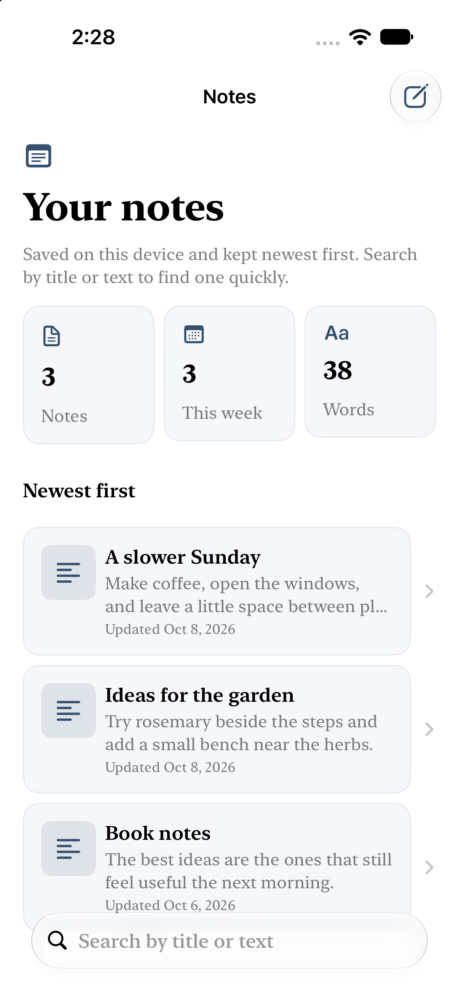
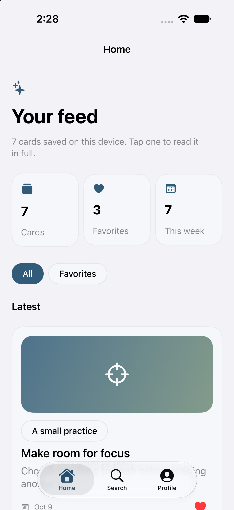
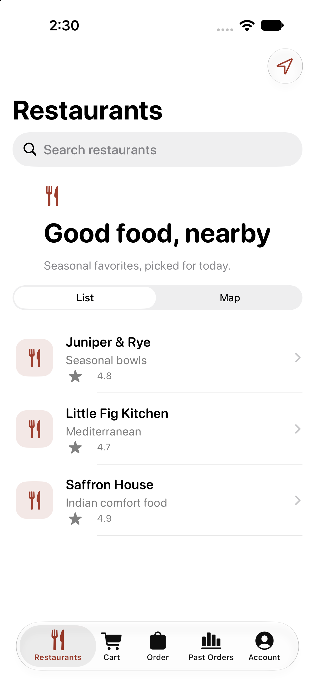
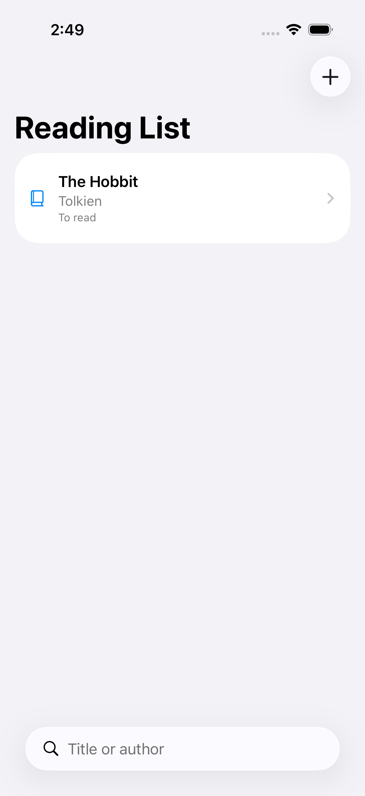

# iOS Agent Skill

**Give your coding agent the Apple references, Swift source and local tools it needs to build and review an iOS app.**

[](https://nagarjuna2997.github.io/ios-agent-skill/)

[Watch the website walkthrough](site/assets/readme-walkthrough.gif) · [Explore the website](https://nagarjuna2997.github.io/ios-agent-skill/)

Describe an app in one sentence and the `/ios-build` agent plans it, writes the SwiftUI code and Xcode project, then builds and runs it in the simulator ([what has been verified](#not-yet), [example apps on the website](https://nagarjuna2997.github.io/ios-agent-skill/agent.html)). For an existing project, the same package gives your coding agent reviews, local Apple references and simulator tools to check its work.

[](https://github.com/Nagarjuna2997/ios-agent-skill/actions/workflows/tests.yml)
[](https://github.com/Nagarjuna2997/ios-agent-skill/actions/workflows/docs-consistency.yml)
[](https://nagarjuna2997.github.io/ios-agent-skill/npm-downloads-details.json)

[Explore the website](https://nagarjuna2997.github.io/ios-agent-skill/) · [Client setup guides](https://nagarjuna2997.github.io/ios-agent-skill/install.html) · [npm](https://www.npmjs.com/package/ios-agent-mcp) · [Release notes](CHANGELOG.md)

## Build an app from one sentence

`/ios-build "<what you want>"` asks Claude Code to plan an iOS app, write its SwiftUI code and Xcode project, apply capability modules (sign-in, storage, payments, maps and more), then build, run and screenshot it in the iOS Simulator, ending with a report of what needs your accounts or money. Published tools are in `ios-agent-mcp` 2.10.1 (npm verified October 3, 2026). The 3.9.1 GitHub branch adds plan-driven design tokens, sample data, palette-aligned assets, and light/dark/XXL screenshot evidence; these MCP changes are not published to npm yet. Four existing apps built and ran on Xcode 27.0; see [examples/agent](examples/agent/README.md) for refreshed evidence.

### Quickstart

Install the published server and Claude Code command:

```bash
claude mcp add ios-agent -- npx -y ios-agent-mcp@latest
npx -y ios-agent-mcp@latest install-command --global
```

Then, in any Claude Code session on a Mac with Xcode 16 or later:

```text
/ios-build "A habit tracker with a list, a detail screen, and settings with dark mode toggle"
```

**Windows/Linux or cloud client:** the GitHub source now includes `build --remote` for unsigned builds and simulator screenshots on GitHub Actions. It requires a destination repository, GitHub CLI authentication and pinned toolkit/Xcode versions. See [remote macOS setup and billing](docs/tooling/remote-macos-build.md). npm publication is deferred.

XcodeGen is optional: without it, the agent writes a folder-synchronized Xcode project itself. The steps are described in [docs/tooling/ios-build-agent.md](docs/tooling/ios-build-agent.md). The four screenshot examples reused existing app folders; this exact one-sentence quickstart has not yet been run from planning through code generation in one Mac session.

### Examples

| Habit tracker | Notes with search | Three-tab feed | Food delivery |
|---|---|---|---|
|  |  |  |  |

Plans, generated sources, run reports and what was and was not exercised: [examples/agent](examples/agent/README.md).

### Capabilities

Every capability is a folder in [capabilities/](capabilities/README.md) with a manifest, recipe, Swift template, apply hook and verify hook. The catalog lists the wider landscape for planning and cost estimates. The counts below are generated from the manifests.

<!-- capability-summary:start -->
| Status | Capabilities |
|---|---|
| Verified on a Mac | 1 |
| Module exists, not yet verified on a Mac | 41 |
| ...of which the Swift compiled on a Mac (combined compile check) | 41 |
| Blocked | 0 |
| Listed for planning only | 120 |

162 catalog entries in 31 categories; generated from [capabilities/CATALOG.md](capabilities/CATALOG.md).
<!-- capability-summary:end -->

### Needs your accounts

The agent builds and runs everything in the simulator without accounts. Capabilities that need a service declare the keys in their manifest. Client keys, such as a publishable key, go in the project's gitignored `.env` file and reach the app through a generated xcconfig. Until they are set, the keys are `REPLACE_ME` placeholders, so the app still builds and shows a configuration message. Server secrets are never put in the app. PLAN.md lists what each run needs and the cost model of each service. Running on a device, using TestFlight or publishing needs your Apple Developer Program membership.

### Not yet

- The design-system capability has passed its own Mac verify run. The other modules remain unverified individually; their combined compile check is not a substitute for each module's verify run (see [the compile check](capabilities/README.md#compile-check)).
- The agent's build, simulator launch and per-screen capture stages ran on Mac for these four existing examples. The original planning and code-generation sessions were separate, and a fresh one-sentence generation has not yet been run end to end on Mac.
- Taps and scrolling during the agent's own screenshots, and device builds, are not done. In the food-delivery example the StoreKit purchase and the Live Activity were not exercised.

## Which workflow to use

| You want to | Use | Notes |
|---|---|---|
| Build a new app from a description | `/ios-build "<description>"` in Claude Code, or `ios-agent-mcp build` | Plans, writes, builds, runs and screenshots; see [above](#build-an-app-from-one-sentence). Available in the GitHub 3.9.1 branch; the published npm package remains 2.10.1. |
| Make an existing project pass your own acceptance tests | `ios-agent-mcp loop` | Runs the checks you write and asks Claude to repair failures; see [the app-building loop](docs/tooling/app-building-loop.md) and the [Reading List demo](samples/ReadingList/README.md). |
| Get an editable starter only | `ios-agent-mcp new MyApp` | A starting point with a brief, not a finished app. |
| Review or extend code you already have | The MCP tools below | File-located reviews, local references, assets and simulator checks. |

## Start with one connection

For Claude Code:

```sh
claude mcp add ios-agent -- npx -y ios-agent-mcp@latest
```

[Set up ChatGPT/Codex, Gemini CLI or Muse](https://nagarjuna2997.github.io/ios-agent-skill/install.html). One npm package includes reviews, local references, app scaffolding and simulator tools. Node.js 20+ is required; local iOS builds need macOS and Xcode; the GitHub-source remote lane runs those steps on Actions.

Then ask:

> Build a SwiftUI reading list with local persistence, search and accessible empty/error states. Reuse the local source library. Build it, run the tests and capture simulator evidence. Explain any checks that fail.

For an existing app, provide its absolute project path and ask for a focused review before making changes.

## What it helps you do

<!-- product-features:start -->
| Feature | What you get |
|---|---|
| Build an app from a sentence | The ios-build agent plans screens, data and capabilities, writes SwiftUI and the Xcode project, then builds, runs and screenshots the app in the simulator. Available in ios-agent-mcp 2.10.0. |
| Start an app | An editable Swift starter, implementation brief and optional XcodeGen specification. |
| Reuse Apple knowledge | Search local Swift source and guides in bounded sections, plus a dated directory of Apple technologies and release notes. |
| Review Swift code | File-located findings for concurrency, architecture, SwiftUI, availability, security, performance and App Intents. |
| Generate design assets | Named light/dark/high-contrast colors and an opaque 1024px app icon rendered locally from editable SVG layers. |
| Review app color systems | Generate semantic palettes and inspect light, dark and high-contrast color evidence. |
| Review backend integration | Identify supported services and review credential, auth, policy and networking evidence locally. |
| Verify on a simulator | Build, test, install, launch and capture screenshots through Xcode. |
| Review launch screens | Conservative target-aware checks for launch configuration, storyboards and asset references. |
| Prepare a local release draft | Inspect selected-target facts, unresolved questions and hashed, resumable local packages without connecting to Apple. |
| App Store Screenshot Studio (GitHub source) | Turn captures into localized screenshot sets with reusable layouts, neutral frames, a preview gallery and validated PNG exports. |
| Apple system integrations (GitHub source) | Preview and review Calendar, Reminders, Contacts, Photos, Camera, Maps, Files, Sharing, Shortcuts and Notifications with permission and capability evidence. |
<!-- product-features:end -->

[Asset generation](docs/design/asset-generation.md) · [Review tools](docs/mcp/tools.md) · [Simulator setup](docs/tooling/ios-simulator-mcp.md) · [Apple release status](docs/apple/ios-27-release-verification.md)

Create a starter directly:

```sh
npx -y ios-agent-mcp@latest new MyApp --brief "A reading list with local storage" --xcodegen
```

The starter is not a finished app: `--xcodegen` writes a `project.yml` that XcodeGen turns into a project. For a complete app from a description, use `/ios-build`. Generated app ownership and branding belong to the user.

## See the evidence

The [Reading List demo](samples/ReadingList/README.md) has persistence, search, simulator acceptance tests and captured screens. The four apps the `/ios-build` agent planned and wrote, with their plans, run reports and simulator screenshots, are in [examples/agent](examples/agent/README.md).

<a href="examples/reading-list/library.png">
  
</a>

The published npm 2.10.1 package includes the build-agent tools and 80 unified tools. They include seven [Apple system integration tools](docs/integrations/README.md) and nine [Screenshot Studio tools](docs/screenshots/README.md). Static reviews are heuristics, not compiler diagnostics. The Apple directory is a reference map, not Apple's proprietary framework source or proof of 405 working integrations. Token savings have not been benchmarked. [Build-loop verification limits](docs/tooling/app-building-loop.md).

## Why use this alongside Xcode?

Xcode already ships agent expertise and build/test tools. Use those when they meet your needs. This repository adds shared guidance across these four client families, inspectable review rules, local source retrieval and repeatable asset workflows. It has not been established that it makes an AI outperform Xcode's skills or use fewer tokens.

[Where the guidance comes from, evidence and unfinished work](docs/evidence-and-scope.md). The [paired benchmark harness](benchmarks/README.md) contains 20 Swift microtasks; results are not published, and it does not yet measure complete app builds.

## Help improve the tools

Failure feedback belongs in your coding session: the observed error, the proposed fix and actual verification results. The source server adds troubleshooting guidance to returned tool errors; agent instructions also cover compiler/test failures. These messages do not appear in the app you are building.

`prepare_issue_report` lets your AI prepare a local report when an iOS Agent tool fails. It accepts fixed categories only, shows a preview and a duplicate-search link, and leaves public submission to you. No app source or logs are collected. [Reporting workflow](docs/tooling/issue-reporting.md).

Included as an experimental tool in 2.7.1: optional `private_feedback` keeps approval in the AI chat and sends fixed categories to a private inbox through a configured HTTPS receiver. Hosting is not configured, so private submission is not live. It never silently submits or falls back to public issues.

## Four client families, one project

| Client | Setup and evidence |
|---|---|
| Claude | Local MCP and source skill; your Claude client supplies the coding agent. |
| ChatGPT / Codex | Codex local MCP; ChatGPT skills package or a separately configured HTTPS/private-tunnel MCP connection. Availability depends on account/workspace policy. |
| Gemini CLI | Extension configuration and local MCP connection verified. |
| Muse Code | Skill discovery, MCP discovery (the 36-tool 2.7.0 server) and a Stop hook verified; model sessions and observer behavior remain unverified. |

The project focuses on these four families. For another client, [open a client-support request](https://github.com/Nagarjuna2997/ios-agent-skill/issues/new?template=client_support.md) or add a 👍 to an existing request. Votes inform priorities alongside feasibility and testing; they do not guarantee delivery. Existing experimental adapters are not actively maintained.

`install.sh` is optional: it installs source guidance for a chosen local client, not the MCP server or a browser plugin. Run `bash install.sh --help` after cloning. Most users should use the client setup guide above.

<details>
<summary>Reference coverage</summary>

<!-- apple-catalog:start -->
Apple catalog tracked: **99** technologies. Covered: **99**. Planned: **0**. Skipped: **0**. Deprecated: **0**. Coverage: **100.0%**.

Source of truth: [`frameworks.json`](frameworks.json). Human index: [`docs/apple-framework-index.md`](docs/apple-framework-index.md).
<!-- apple-catalog:end -->

Coverage counts describe documentation, not compiled integrations. Download counts refresh daily and are not unique users.
</details>

[Contributing](CONTRIBUTING.md) · [Development](docs/development.md) · [Security](SECURITY.md) · [Roadmap](ROADMAP.md) · [MIT license](LICENSE)

Backend integration guidance: [choose a service and review auth, data and security boundaries](docs/backend/overview.md).

## Optional provider commands

Use `ios-agent-mcp environment` to inspect the actual Xcode/SDK/simulator inventory.
`ios-agent-mcp ai models` and `ai doctor` inspect the dated catalog and account/local availability.
Text generation defaults to on-device Apple models; cloud providers and fallback require explicit configuration.
[Provider setup, handoff, simulator CLI and limits](docs/ai/providers.md). These commands do not replace the coding client or claim autonomous app completion.

## Local Apple documentation

Install the archive in Xcode → Settings → Components → Developer Documentation. Read it through Window → Developer Documentation (Shift–Command–0 with standard key bindings). This integration uses `xcrun mcpbridge`; the archive stays managed by Xcode.

Use `xcode-mcp tools` for discovered Xcode schemas and `doctor xcode` for setup diagnostics.

Use `ios-agent-mcp docs status` and `ios-agent-mcp docs symbol SwiftUI.NavigationStack` for version-aware documentation grounding. The adapter prefers Xcode MCP DocumentationSearch, then bounded SDK evidence. Apple’s archive is never bundled. Bridge authorization is required; retrieval is not automatic code validation. [Setup, tools and limitations](https://nagarjuna2997.github.io/ios-agent-skill/guides/tooling-local-apple-documentation.html).
