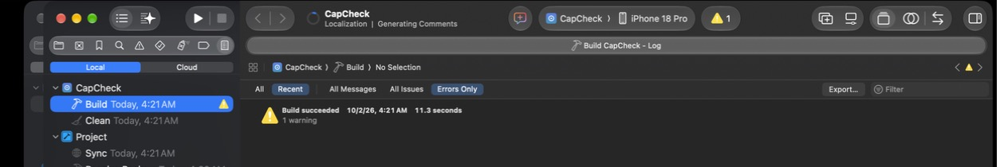

# Capability modules

Every capability an app can need (a sign-in provider, a backend, payments, maps, charts, a launch screen, an app icon, an animation runtime, ...) is one folder here with the same contract. The build agent never special-cases a capability: adding one is adding a folder.

```text
capabilities/<id>/
  manifest.json   requirements, credentials, cost, status (validated by the loader)
  recipe.md       how to implement it correctly; links the repository guides
  template/       Swift and resource files copied into <AppName>/Capabilities/<Id>/
  apply.ts        extra project changes beyond the manifest (often none)
  verify.ts       builds the capability into a minimal app on a Mac
```

## manifest.json

| Field | Meaning |
|---|---|
| `id` | kebab-case, equal to the folder name |
| `name`, `description` | shown in plans and reports |
| `category` | one of the categories in `mcp-server/src/agent/capabilities.ts` |
| `default` | `true` for the one Apple-native default of its category |
| `appleNative` | `true` when only Apple frameworks are used |
| `alternatives` | other capability or catalog ids for the same need |
| `requires.capabilities` | modules applied first |
| `requires.infoPlist`, `requires.entitlements`, `requires.buildSettings` | merged into the app; conflicting values are an error |
| `requires.packages` | Swift packages (`name`, `url`, `version.from` or `version.exactVersion`, `products`) |
| `credentialsNeeded` | `key`, `description`, `whereToGet`, `kind` (`client` keys may ship in the app; `server` secrets never do) |
| `cost` | `model` (`free`, `one-time`, `subscription`, `usage-based`), `note`, `link`, and `amounts` only when confirmed on the vendor page (`verified`, `checkedOn`, `source`) |
| `platforms`, `minOS` | the deployment target is raised to the highest `minOS` applied |
| `status`, `statusNote` | `verified` (requires `verification.json` from a passing verify run), `untested` or `blocked` |
| `docs` | repository guides the recipe draws on |
| `usage` | instructions for code generation: the types the template provides and how to use them |
| `destination` | optional folder under the app sources; default `Capabilities/<PascalCaseId>` |

Template files may use `__APP_NAME__`, `__BUNDLE_ID__` and `__DISPLAY_NAME__`; they are substituted when copied. Existing files in the app are never overwritten.

## apply.ts and verify.ts

```ts
import { defineApply } from "../_sdk/index.js";
export default defineApply(() => {});
```

```ts
import { defineVerify } from "../_sdk/index.js";
export default defineVerify((ctx) => ctx.buildMinimalApp({ "Views/VerifyUsage.swift": "..." }));
```

The apply context (`capabilities/_sdk/index.ts`) can set Info.plist keys, entitlements, build settings and packages; set the app icon; exclude files from the app target; set the scheme's StoreKit configuration; render SVG to PNG; write files under the app sources; and add a widget with `addWidget`. The first `addWidget` call creates one WidgetKit extension target, `<AppName>Widgets`, embedded in the app; every widget and Live Activity joins its generated `WidgetBundle`. Widget files stay in the capability's template folder: `sources` lists folders compiled into the extension, and `extensionOnly` folders are also excluded from the app target, so code shared by both targets lives in a folder listed only in `sources`.

`buildMinimalApp` creates a minimal SwiftUI app, applies the capability with its dependencies, adds the given files and builds for the iOS Simulator. It returns `blocked` when Xcode, a simulator or XcodeGen is missing. `mcp-server` compiles these files when it builds (`mcp-server/scripts/bundle-capabilities.mjs`).

## Status

`untested` is the honest default: the module's files and settings are written, but its own build check has not passed on a Mac. Run `ios-agent-mcp capabilities verify <id> --write ./capabilities` on a Mac with Xcode to mark it `verified`.

## Compile check

`verify` builds one module at a time and needs XcodeGen. The compile check is a faster, coarser test: `scripts/capability-compile-check.mjs` writes a project named CapCheck with every module applied and every module's usage file, all in one app target. The project uses a folder-synchronized group, so it opens in Xcode 16 or later without XcodeGen.

```bash
(cd mcp-server && npm run build)
node scripts/capability-compile-check.mjs --out ~/CapCheck
open ~/CapCheck/CapCheck.xcodeproj    # then Product > Build
```

A manifest's `compileCheck` block records a real build of that project: the date, Xcode version, destination, Swift language mode and result. It is written by hand after a build, and never from a fake toolchain. A passing compile check shows that the module's Swift compiles alongside every other module. It does not cover the XcodeGen project, entitlements, the widget extension target or runtime behavior, so `status` stays `untested` until the module's own verify run passes.

Last recorded run, 2026-10-02: a clean build with Xcode 27.0 for the iPhone 18 Pro Simulator in Swift 6 language mode. The CapCheck project contained 33 modules and 69 Swift files, and the build succeeded with one warning, which came from the prebuilt Lottie binary.


