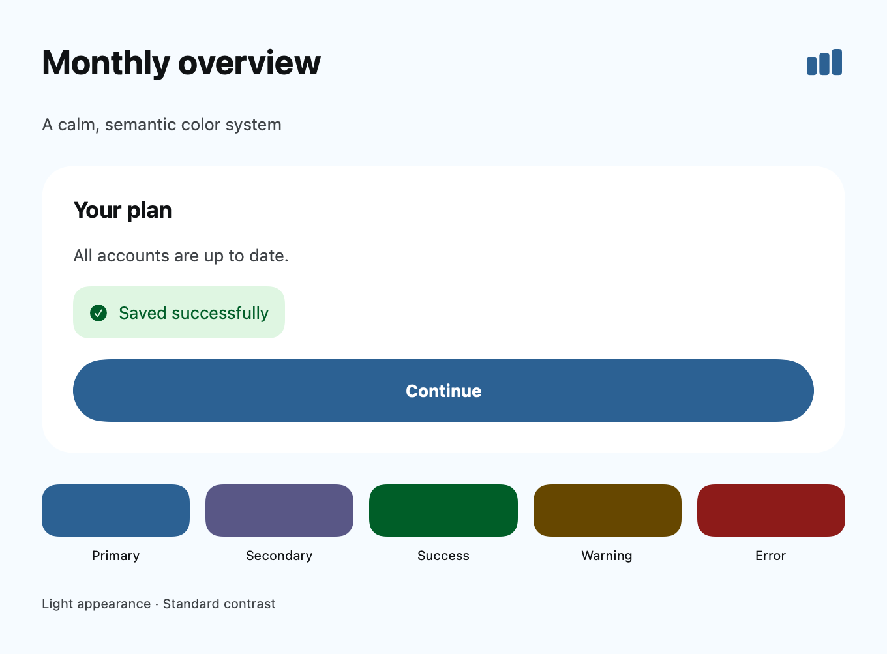
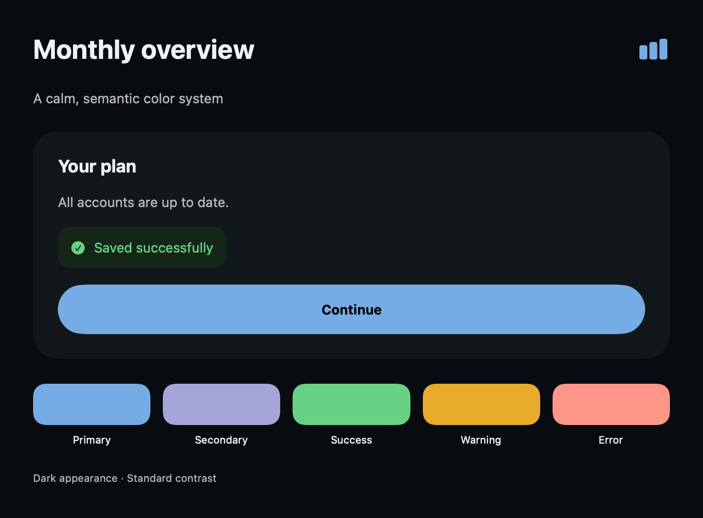

# Generate an iOS palette from a brief

## Context

`generate_color_system` returns an offline, deterministic preview. It does not call a model, fetch an image, write tokens, or change an asset catalog. An explicit `imagePath` lets the MCP adapter read a bounded local PNG; the pure generator itself accepts sample colors. This capability is local source work, not a claim about the currently published npm version. Start from the existing [design-token contract](design-tokens.md), and keep native system semantics wherever custom branding adds no value.

## Workflow

1. Ask for the app task, a seed if available, and the emotional intent. A description is sufficient; do not make users fill every field.
2. Generate a preview, inspect the rationale and contrast pairs, then compare it in the app's actual UI.
3. Choose or revise the seed, family and harmony. Color meaning depends on the audience; finance is not required to be blue.
4. Only when requested, save `assetTokens` to a JSON file and run the existing [asset generator](asset-generation.md). It refuses to overwrite a catalog. Review and merge the intended assets.
5. Build the app, inspect both appearances and Increase Contrast, and test non-color state indicators.

```json
{
  "description": "Minimal finance app for young professionals. Calm, trustworthy, premium. Prefer blue.",
  "category": "finance",
  "mood": ["calm", "trustworthy", "premium"],
  "family": "Blue",
  "strategy": "dominant-plus-supporting",
  "appearance": "both",
  "accessibility": "standard"
}
```

The result includes the seed and its provenance, rationale, all semantic tokens, light/dark palettes, high-contrast variants, eleven-step tonal scales, contrast rows, restrained gradient samples, SwiftUI/UIKit snippets, and compatible asset-token JSON. `appearance` records a preference; both modes are always returned. `oled` makes the dark base black but keeps raised surfaces distinguishable.

## Inputs and precedence

A valid seed is opaque sRGB `#RRGGBB`. Priority is `primaryColor`, first `brandColors`, `existingTokens.primary` or `.Primary`, first `existingColors`, extracted sample candidate, then the intent heuristic. All values are validated and bounded. Existing tokens are seed input, **not** an automatic migration preserving every role. Explicit brand input is kept as `seed`; UI variants may differ to meet measured contrast constraints.

Image samples are `{ "color": "#2457DB", "weight": 20 }` in `imageSamples`. Read [brand extraction](brand-color-extraction.md) before interpreting them. A project reviewer inventory can supply `existingColors`; project files are never read by the generation tool itself.

## Families and strategies

Hue families: Neutral / Minimal, Blue, Indigo, Violet, Purple, Magenta, Teal, Cyan, Green, Emerald, Mint, Yellow, Amber, Orange, Red, Rose, Pink, Brown / Earth, Navy / Midnight, Slate / Graphite.

Treatment families: Pastel, Muted, High Contrast, Monochrome, Gradient-led, Dark OLED, Warm Light, Cool Light, Glass / Translucent, Dynamic Brand, Category-aware palettes. Families are heuristic starting points, not copyrighted themes or a catalog of fixed RGB tables. Some are treatment hints: Glass returns an opaque fallback and material guidance, not a simulated Apple material. High Contrast sets the enhanced contrast target; Gradient-led defaults to restrained gradient. Both can also be requested with the explicit accessibility and strategy inputs.

Available harmonies are monochromatic, analogous, complementary, split-complementary, triadic, neutral-plus-accent, dominant-plus-supporting and restrained gradient. Supporting hues use limited chroma. The intent hash varies automatic seeds within the suggested hue area, so a category does not force a single color. Free-form categories and moods are accepted; heuristics recognize broad groups and fall back to restrained neutrals. There is no semantic language model interpreting every word.

## Perceptual derivation

sRGB is decoded to linear RGB, converted to OKLab/OKLCH, and mapped back to sRGB by reducing out-of-gamut chroma while holding lightness and hue. Tonal steps are 50, 100, 200, 300, 400, 500, 600, 700, 800, 900 and 950, with intentionally tapered chroma at the ends. Near-neutral colors have unstable perceptual hue; they are treated as neutrals.

Contrast repair searches lightness while preserving hue and as much chroma as the gamut allows. This is an engineering constraint, not proof of visual quality. Gradient stops follow a short OKLCH hue arc; stop samples do not prove contrast at every rendered pixel or interpolation space. Use gradients decoratively unless the rendered foreground has been verified.

## Implementation

The returned `implementation` strings define named-color accessors. Add assets to the **same target** that loads them. For a Swift package pass its resource bundle explicitly; see `samples/ColorSystem`.

```swift
Text("Continue")
    .foregroundStyle(AppColors.onPrimary)
    .padding()
    .background(AppColors.primary)
```

Do not apply `onPrimary` to an arbitrary gradient, disabled fill or destructive fill. Each is a separate foreground/background relationship. Use native `Button(role: .destructive)` when possible.

## Verification

Regression tests cover determinism, all families, token completeness, gamut output, tonal ordering, OLED and high contrast, input bounds, image-sample filtering and direct project evidence. They do not establish beauty, cultural meaning, native material behavior or App Review acceptance.

## Native preview

These SwiftUI renders use the sample's compiled named-color assets on macOS. They show the sample palette, not an iOS Simulator acceptance test. Reproduce with `samples/ColorSystem/render-preview.swift`; see the sample README for the asset compilation step.





The perceptual math follows [the published OKLab definition](https://bottosson.github.io/posts/oklab/); no third-party palette branding or fixed theme was copied.
