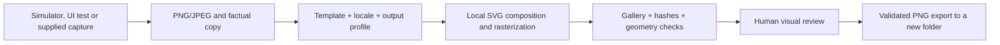

# App Store Screenshot Studio

Turn existing simulator captures into localized, reusable marketing layouts. **GitHub source only; not included in npm 2.7.2.** Screenshot Studio runs offline in the unified server and never uploads images. Existing [simulator capture](../tooling/ios-simulator-mcp.md), UI-test attachments and Fastlane snapshot output remain the capture layer.



## Build and use

From a repository checkout:

```bash
npm ci --prefix mcp-server
npm run build --prefix mcp-server
node mcp-server/dist/unified.js screenshots list
node mcp-server/dist/unified.js screenshots variants --config recipe.json --output ./new-set
node mcp-server/dist/unified.js screenshots preview --set ./new-set
node mcp-server/dist/unified.js screenshots inspect --set ./new-set
node mcp-server/dist/unified.js screenshots export --set ./new-set --output ./export
```

Configure your MCP client with `node /absolute/checkout/mcp-server/dist/unified.js` to use the unpublished source tools. No additional server is required. Do not use the npm command expecting these tools until a package release includes them.

A recipe accepts ordered screens; reordering the array changes sequence. Copy is supplied by the user/agent from observed app behavior. If headline is omitted, the supplied description or app name is used verbatim; the renderer does not invent benefits or call a model. English superiority claims such as “best”, “fastest”, “#1” and “most secure” are rejected; this is a narrow guard, not multilingual fact checking. Review all copy yourself.

```json
{
  "appName": "My Library",
  "templates": ["minimal", "dark-premium", "gradient"],
  "profile": "iphone-portrait",
  "locale": "en-US",
  "outputDirectory": "./new-set",
  "screens": [
    {"image":"./captures/library.png","headline":"Keep books together","subtitle":"Browse your saved reading list","badge":"Library"}
  ]
}
```

For a folder, use `--input ./captures --template minimal --output ./new-set`. The tool imports 1–10 PNG/JPEG files in filename order. Folder defaults use the supplied app name, not invented screen descriptions; use a recipe for real copy. All relative input paths are resolved from the command's working directory. The MCP tools accept the same recipe under `recipe`.

Optional fields: `projectPath` reads existing asset catalog colors using the color-system reviewer, preferring a light AccentColor; `accent` overrides that inspiration with a six-digit hex color; `iconPath` embeds an actual supplied PNG/JPEG icon; `fontPaths` selects local fonts. Source assets are never modified. App-name discovery from generated/multiple-target plists and automatic icon selection are not attempted: supply the correct target's name/icon.

## Tools and layouts

| Tool | Responsibility |
|---|---|
| `list_screenshot_templates` | List layouts and dated profiles |
| `get_screenshot_template` | Inspect a layout's text, device and safe-region requirements |
| `generate_screenshot_set` | Render ordered screens to a new local directory |
| `generate_screenshot_variants` | Render at least two templates for comparison |
| `render_app_store_screenshot` | Render exactly one screen/template |
| `preview_screenshot_set` | Validate and return the generated gallery/contact sheet paths |
| `inspect_screenshot_set` | Check dimensions, format, hashes and recorded geometry |
| `export_screenshot_set` | Validate and copy PNGs plus export metadata to a new directory |
| `localize_screenshot_set` | Re-render supplied translated copy, preserving screen order/layout |

| Template | Structure |
|---|---|
| minimal | Hero copy above one centered device |
| dark-premium | Offset device and copy over a soft radial dark field |
| gradient | Feature composition over a gradient, with opaque copy panel |
| editorial | Side-by-side text and device; mirrored for RTL |
| feature-card | Screenshot inside a larger rounded card |
| full-bleed | Larger contained screenshot, separate safe copy area |
| comparison | Exactly two supplied images, equal weight |
| multi-device | Two or three supplied images in individual frames |

Use `additionalImages` on a screen for comparison/multi-device. Other templates require one image. “Full bleed” extends the surrounding design, not the app UI: screenshots are contained with original aspect ratio and are never stretched or cropped. Neutral rounded bezels are rendered programmatically; they are not official Apple artwork. No camera cutout covers app content. Text and simple badges stay outside supplied UI. This first version does not provide angled/3D devices, arrows, source-image corner masking or custom template plugins.

## Localization and typography

```bash
node mcp-server/dist/unified.js screenshots localize --set ./new-set --locale es-ES --copy translated.json --output ./spanish-set
```

`translated.json` is an ordered array containing a headline and optional subtitle/badge for **each** screen. Translation is supplied, not performed by a hosted service. MCP also accepts `fontPaths` for this operation. Provide a font covering the complete text for Japanese, Korean, Chinese or other scripts; the tool refuses missing glyphs rather than rendering empty boxes. System Arial (macOS/Windows) or DejaVu Sans (Linux) is the default; no proprietary font is distributed. Font hashes are recorded and glyphs rendered as paths for reproducibility. A single font must cover a text run so connected-script shaping stays intact.

Long copy wraps by grapheme, preferring spaces. Overflow fails the entire new set rather than clipping or shrinking text to illegibility. Arabic/Hebrew/Farsi/Urdu select RTL automatically; `direction` can be supplied explicitly. Layouts mirror where applicable. Explicit bidi control characters are rejected; mixed-direction text (including numbers, non-Arabic/Hebrew letters or paired brackets in RTL) is rejected because full Unicode bidi segmentation is not implemented. Font changes can alter wrapping; reproduce with the same font files and renderer versions.

## Output and validation

```text
new-set/
  en-US/minimal/iphone-portrait/01.png
  en-US/dark-premium/iphone-portrait/01.png
  screenshot-set.json
  preview.png
  preview.html
```

Each set is one locale and device profile, with up to eight templates and ten screens. Run separate sets for other devices/locales. Output directories must not already exist. Failed renders remove the newly created set; input captures remain unchanged. Metadata records copy, source hashes, output hashes, placement, typography, warnings, render date and renderer versions. **The local manifest contains absolute source/font paths: inspect it before sharing.** Exports contain output metadata without the original recipe paths.

The dated profiles in `mcp-server/src/screenshots/catalog.ts` are separate from layout code:

| Profile | Pixels |
|---|---|
| iphone-portrait | 1260 × 2736 |
| iphone-landscape | 2736 × 1260 |
| ipad-portrait | 2064 × 2752 |
| ipad-landscape | 2752 × 2064 |

Source: [Apple screenshot specifications](https://developer.apple.com/help/app-store-connect/reference/app-information/screenshot-specifications), checked September 29, 2026. These are accepted size options, not a determination of required device classes for your app. Recheck Apple's requirements before submission. Outputs are opaque RGB PNGs; transparent source pixels are flattened onto white with a warning. Static sRGB PNG/JPEG inputs only: animated/profiled PNG and EXIF/profiled JPEG must be normalized first. Inputs are bounded to 24 MiB and 16 megapixels.

Inspection checks PNG dimensions/format, hashes, filenames, manifest consistency, source aspect ratio, recorded text/image bounds, minimum text size and 4.5:1 text-panel contrast. Repeated source images in the same variant produce warnings because repetition can be deliberate. Hashes detect accidental alteration; they are not signed attestation. Geometry comes from this renderer, not OCR; arbitrary edited manifests cannot establish screenshot quality. Human review remains necessary for readable embedded app UI, correct copy, locale typography, cropping inside the original capture and App Review rules. “Checks passed” never means “approved by Apple.”

## Reproducible example

See [Reading List Screenshot Studio example](../../samples/ScreenshotStudio/README.md) for five real repository captures, three variants and supplied English/Spanish copy. Historical app/agent benchmarks are unchanged; rendering evidence makes no claim of higher conversion or agent performance.
