# Agent examples

These apps were produced from the requests below on 2026-10-02. Each folder contains the agent's PLAN.md and RUN_REPORT.md, the generated Xcode project and Swift sources, and screenshots from the iOS Simulator.

## What ran, and what did not

Each example went through two machines.

1. **Plan, project and code.** `ios-agent-mcp build "<request>"` ran with headless Claude Code as the model. This happened in a Linux session that had no Xcode. The agent planned the app, wrote PLAN.md, applied the capability modules and wrote the SwiftUI code. It then stopped at its toolchain check. So RUN_REPORT.md says `failed (toolchain missing)` and lists no builds: that is the true outcome of that run.
2. **Build and run.** The project was written by the agent's built-in Xcode project writer. It was opened in Xcode 27.0 on a Mac and run on the iPhone 18 Pro Simulator (iOS 27.0) with Product > Run. Every example built without errors on the first build, with no code changes. The screenshots were taken from the running simulator, and the screens were reached by tapping.

Not exercised: the agent's own `xcodebuild` build-and-fix loop and its `simctl` launch and screenshot steps. That session could click in Xcode but had no shell on the Mac. Treat the first full `/ios-build` run on a Mac as the remaining acceptance test.

## Examples

| Request | App | Screens | Capabilities applied | Result |
|---|---|---|---|---|
| A habit tracker with a list, a detail screen, and settings with dark mode toggle | [HabitTracker](habit-tracker/PLAN.md) | habit list, habit detail, settings | swiftdata, appearance-settings, accessibility-baseline, haptics, color-assets, app-icon | Built on the first build and ran |
| A notes app with SwiftData persistence, search, and a compose screen | [QuickNotes](notes-app/PLAN.md) | notes list with search, compose, note detail | swiftdata, accessibility-baseline, haptics, share-sheet, app-icon, color-assets | Built on the first build and ran |
| A three-tab app: Home feed of cards, Search, Profile | [TabFeed](three-tab-app/PLAN.md) | home feed, search, profile, card detail | swiftdata, accessibility-baseline, color-assets, appearance-settings, photos-picker, share-sheet, app-icon, launch-screen | Built on the first build and ran; see the runtime issue below |
| A food delivery app: splash screen with logo animation, Sign in with Apple and email, restaurant list with map, cart, checkout with StoreKit, order status with a live activity, and a dashboard of past orders. | [FoodDash](food-delivery/PLAN.md) | splash, sign-in, restaurants (list and map), menu, cart, checkout, order status, past orders dashboard, account | 20 modules, listed in [its run report](food-delivery/RUN_REPORT.md), including the WidgetKit extension for the Live Activity and the Lottie package | Built on the first build (app and widget extension, no errors) and ran |

Each plan also named capabilities that have no module yet (`sf-symbols`, `search`). The agent listed them under "Requested but not built" instead of inventing them.

### Habit tracker

| Habits | New habit | Settings |
|---|---|---|
| 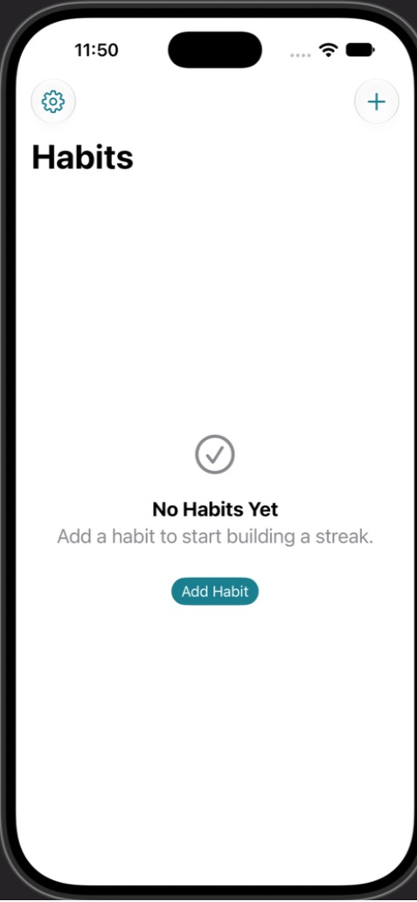 | 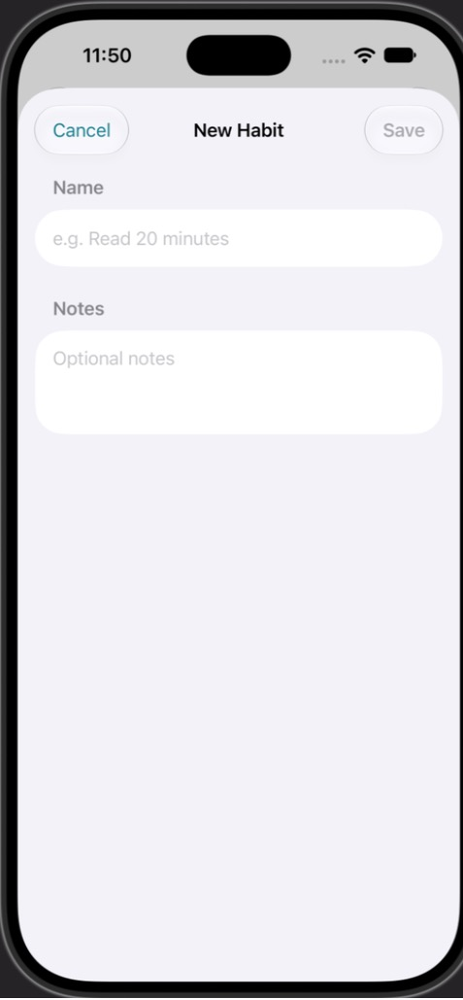 | 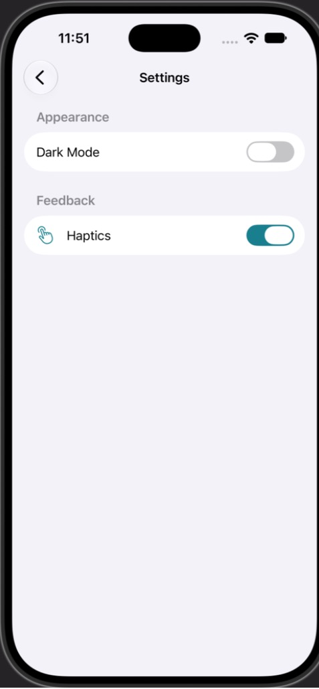 |

### Notes

| Notes with search | Compose |
|---|---|
| 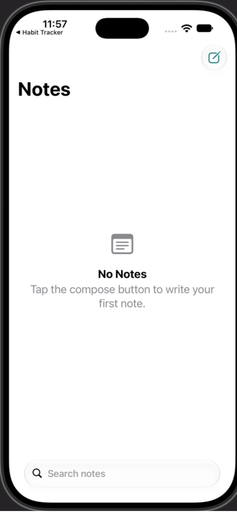 | 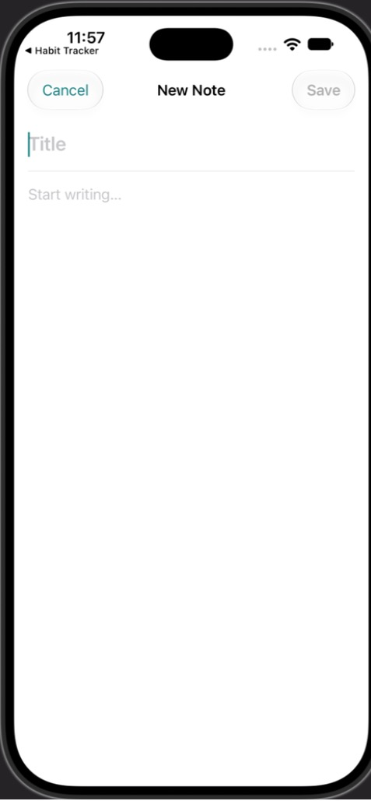 |

### Three tabs

| Home | Search | Profile |
|---|---|---|
| 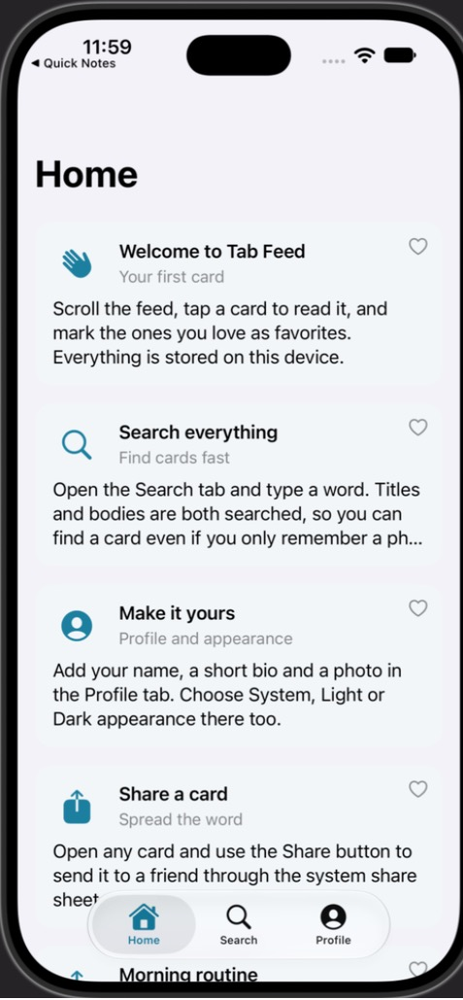 | 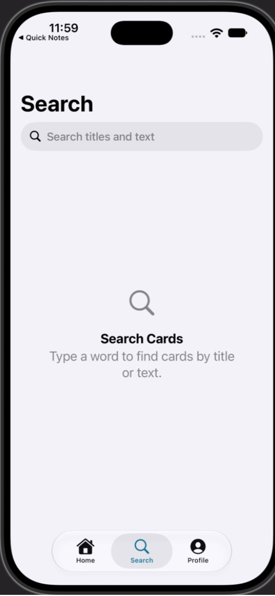 | 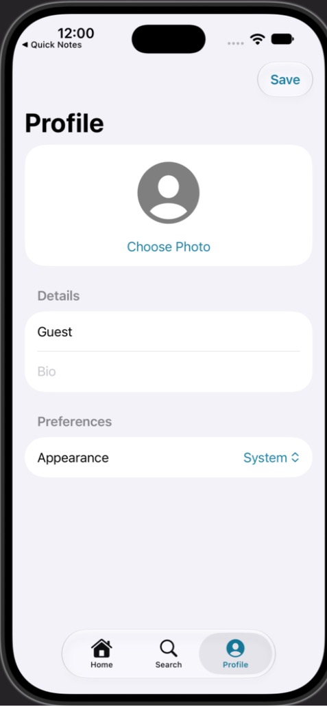 |

### Food delivery (composite)

| Sign-in | Email with placeholder keys | Restaurants | Map |
|---|---|---|---|
| 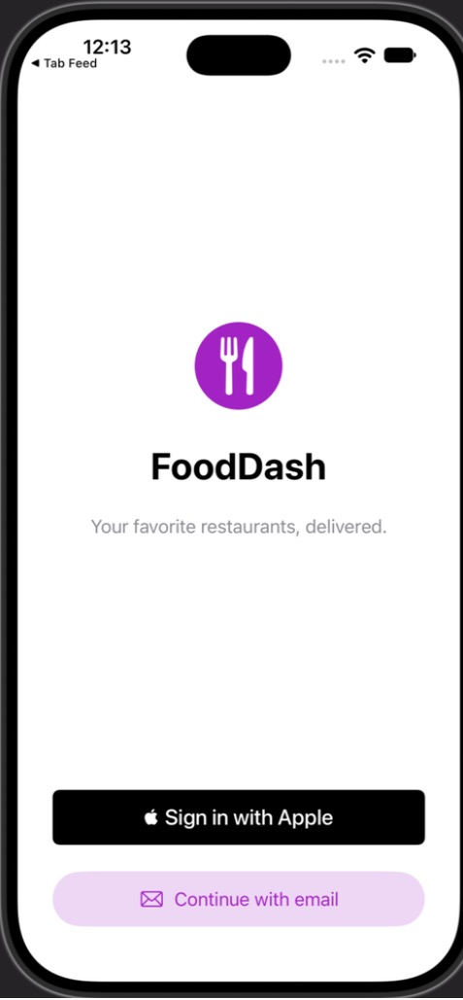 | 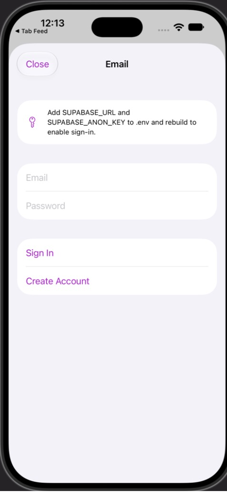 | 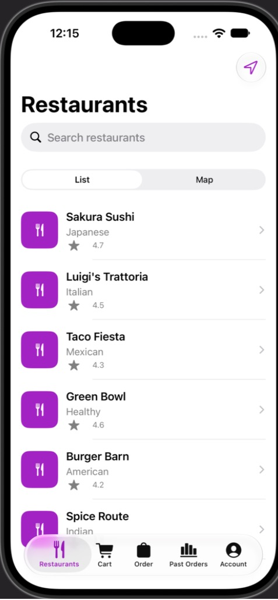 | 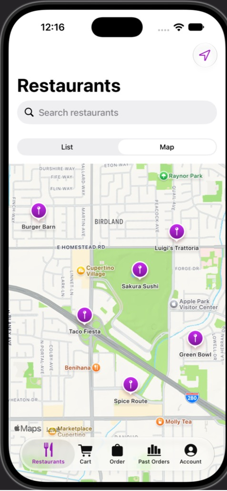 |

| Menu | Cart | Checkout | Past orders |
|---|---|---|---|
| 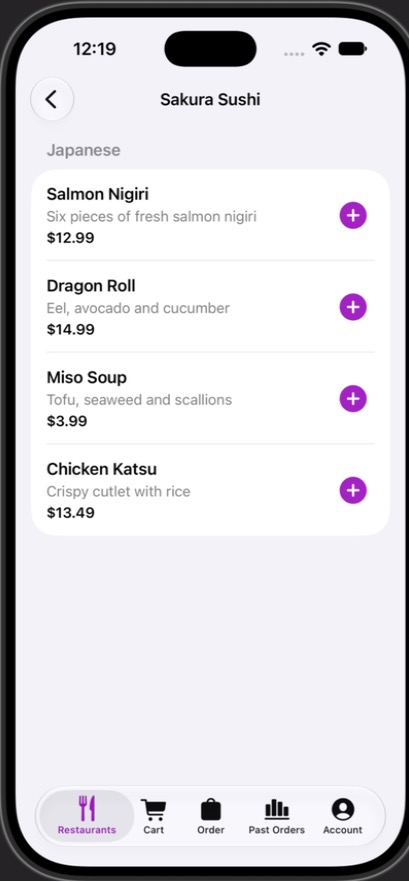 | 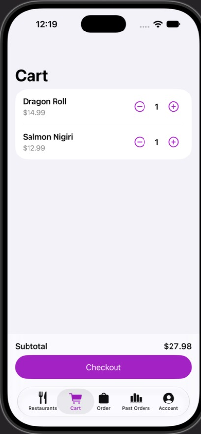 | 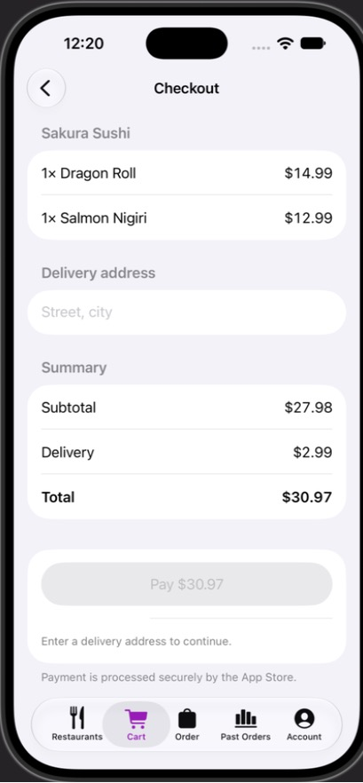 | 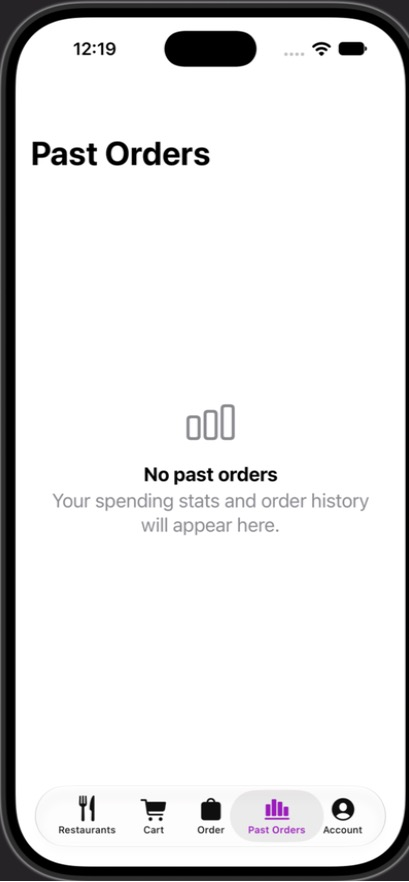 |

What these show about the composite:

- **Placeholder credentials.** Email sign-in uses Supabase keys the run did not have, so they are `REPLACE_ME`. The app builds anyway and says which keys to add (second screenshot). `API_BASE_URL` is also a placeholder. Without it the app uses its bundled sample restaurants.
- **What worked by tapping.** Adding two dishes to the cart, the subtotal and the checkout summary. Checkout stopped at the delivery address field, because typed text did not reach the simulator. So the StoreKit purchase, the Live Activity and the dashboard charts with real orders were not exercised.
- **Reaching the tabs behind sign-in.** Sign in with Apple needs an Apple Account on the simulator, and email sign-in needs keys. The tabs were reached by adding the agent's own launch argument, `-ios-agent-screen restaurants`, to the shared scheme on the Mac. The agent passes the same argument with `simctl launch`. That scheme edit is not in the committed copy.
- **Not a store-ready design.** The request asked for StoreKit at checkout. Apple's App Review Guidelines require apps that sell physical goods or services used outside the app to use a payment method other than in-app purchase. A real food delivery app would use Apple Pay or a card processor. The plan noted that the StoreKit module "needs adapting".
- **Budget bug, found in this PLAN.md.** Sign in with Apple and StoreKit each listed the Apple Developer Program membership, and the budget added it twice ($198 per year). The budget now counts a shared item once. This PLAN.md is left as generated.
- **Same runtime warning as TabFeed.** The generated code also stored `ScaledSpacing` in `@State`. The module guidance has since been fixed.

## Found by running

- **TabFeed runtime issue.** Xcode reported repeated SwiftUI runtime warnings: "Accessing Environment's value outside of being installed on a View". The generated views stored `ScaledSpacing` in `@State`. The accessibility-baseline module's own documentation had told the model to do that. A `DynamicProperty` inside `@State` is never installed, so its `@ScaledMetric` values do not scale. The module now says to store it directly on the view (`private let spacing = ScaledSpacing()`). The example is left as generated. A fresh run of the same request at 12:42 produced `private let spacing = ScaledSpacing()` in every view. It built on the first build, and Xcode showed no runtime issues while the Home tab was open.
- **Input not tested.** Text typed from the Mac keyboard did not reach the simulator during this session, and the dark mode toggle did not respond to a click. So adding a habit, saving a note and switching appearance were not exercised. Those screenshots show empty states.

## Reproduce

On a Mac with Xcode 16 or later, from a checkout of this repository (the `build` command is not in a published package yet):

```bash
cd mcp-server && npm ci && npm run build && cd ..
node mcp-server/dist/unified.js build "A habit tracker with a list, a detail screen, and settings with dark mode toggle" --out ./habit-tracker
```

The model's output differs from run to run, so a new run will not reproduce these files exactly.
