# Run report: FoodDash

Request: A food delivery app where users sign in with Apple or email, browse nearby restaurants on a list or map, build a cart, and pay at checkout using StoreKit. After ordering, they follow progress with a Live Activity on the Lock Screen and Dynamic Island, and review past orders on a dashboard.

## Result

- Status: **complete**
- Elapsed: 36 min; build attempts: 1 (cap 8 per cycle, 2 cycles)
- Last build: succeeded in 17.6 s
- Launched: yes, on iPhone 18 Pro (B4A70BB0-841F-4E38-92DD-7935C63778C2), pid 69612
- Screenshots: 15
- Toolchain: Xcode 27.0 (27A266a); simulator iPhone 18 Pro (iOS 27.0)
- External tool calls logged: 241 (`.ios-agent/tool-log.jsonl`)

## Design evidence

- Direction: warm, fresh, and generous; Market Table palette; rounded typography; organic shapes; comfortable density; expressive motion.
- Palette on-color contrast: PASS (4.5:1 minimum for all generated light/dark semantic color pairs).
- Generated semantic colors match the approved plan palette: PASS.

| Color | Light | Dark | WCAG AA |
|---|---:|---:|---|
| BrandPrimary | 6.64:1 | 6.64:1 | Pass |
| BrandSecondary | 4.89:1 | 4.89:1 | Pass |
| BrandAccent | 4.70:1 | 4.70:1 | Pass |

### restaurants — light, dark and XXL captured

| Light | Dark | XXL Dynamic Type |
|---|---|---|
|  | 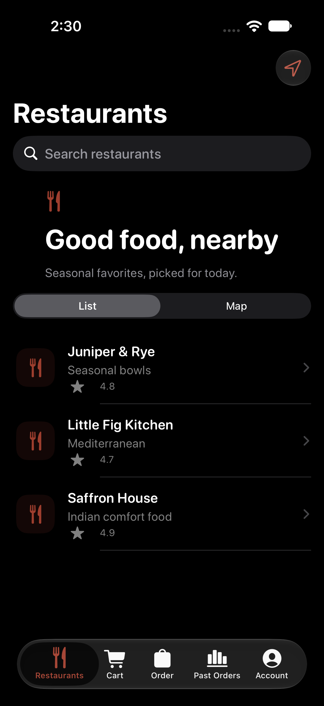 | 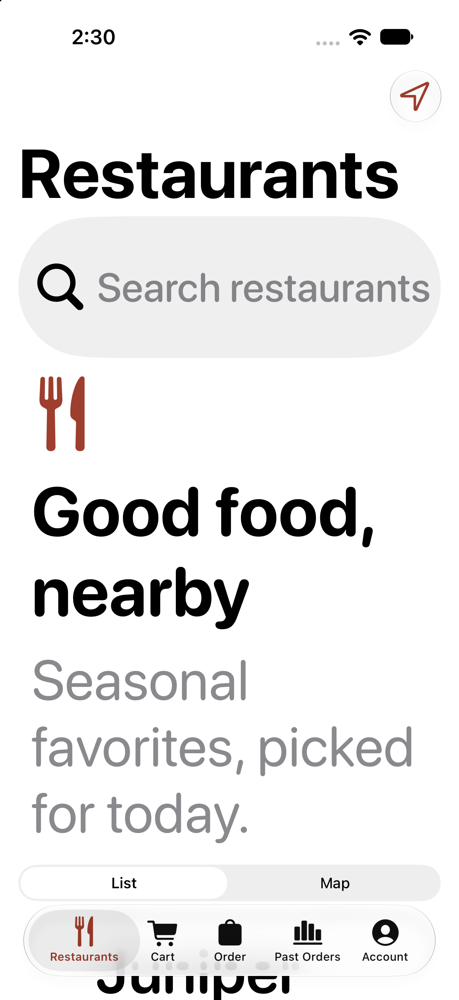 |

### cart — light, dark and XXL captured

| Light | Dark | XXL Dynamic Type |
|---|---|---|
| 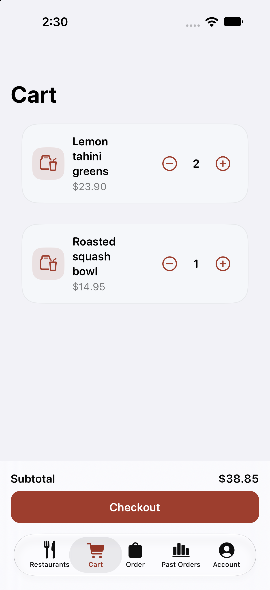 | 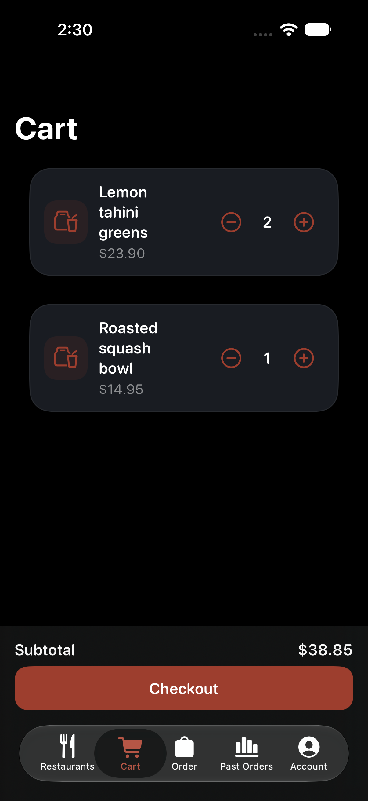 | 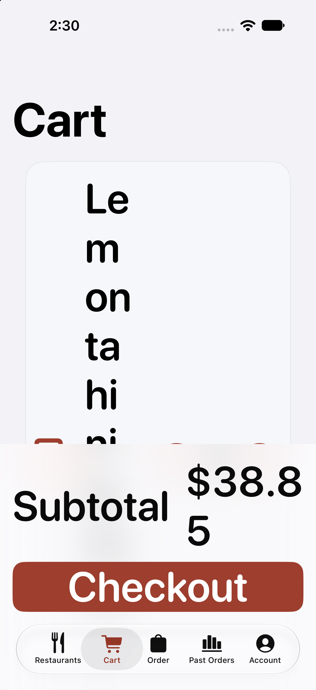 |

### order-status — light, dark and XXL captured

| Light | Dark | XXL Dynamic Type |
|---|---|---|
| 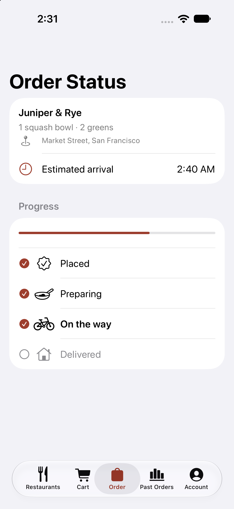 | 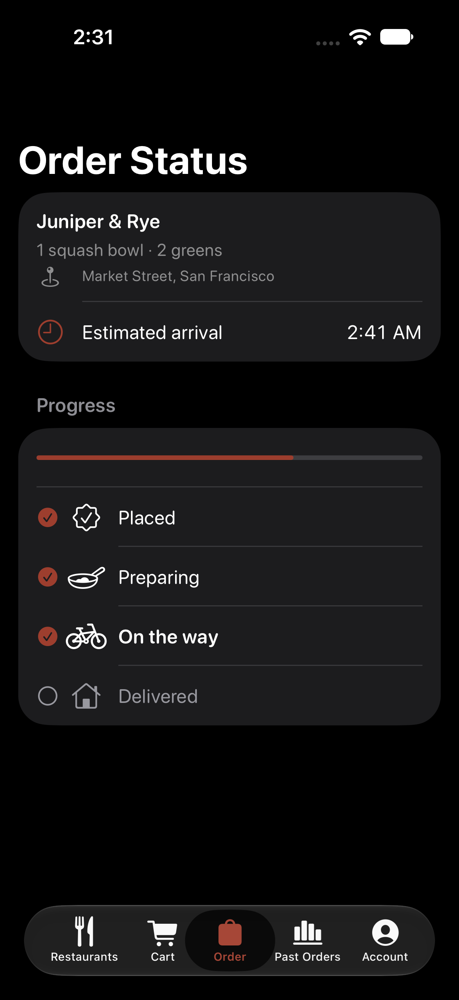 | 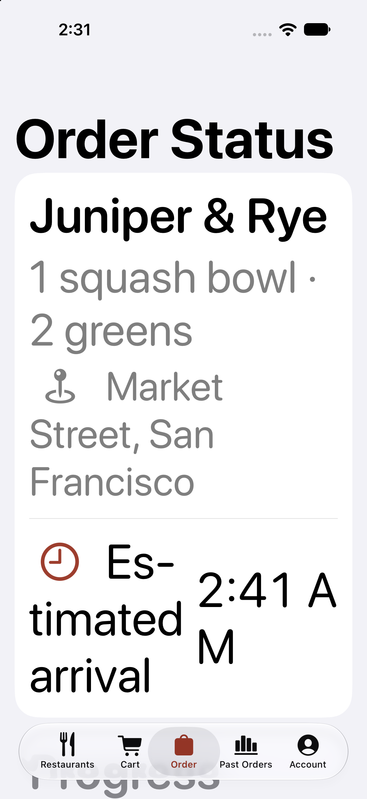 |

### dashboard — light, dark and XXL captured

| Light | Dark | XXL Dynamic Type |
|---|---|---|
| 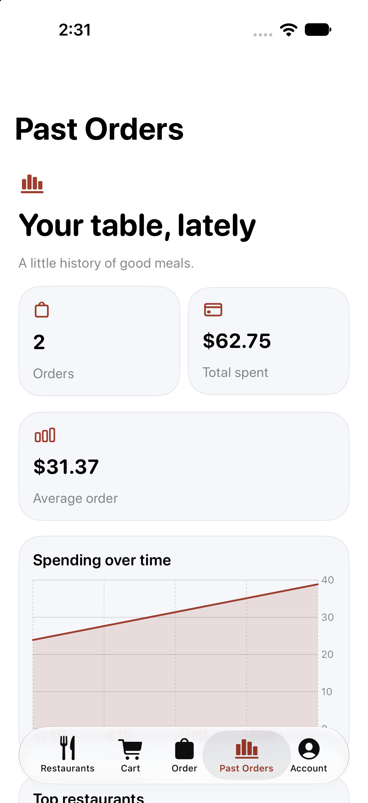 | 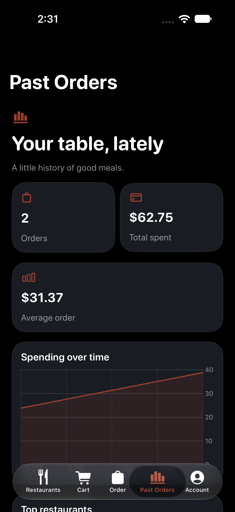 | 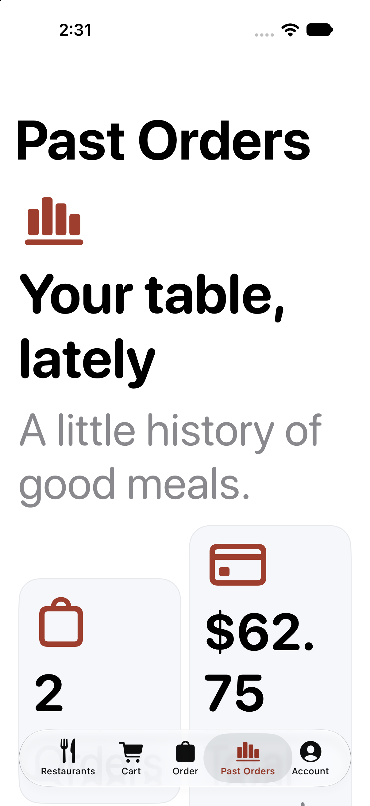 |

### account — light, dark and XXL captured

| Light | Dark | XXL Dynamic Type |
|---|---|---|
| 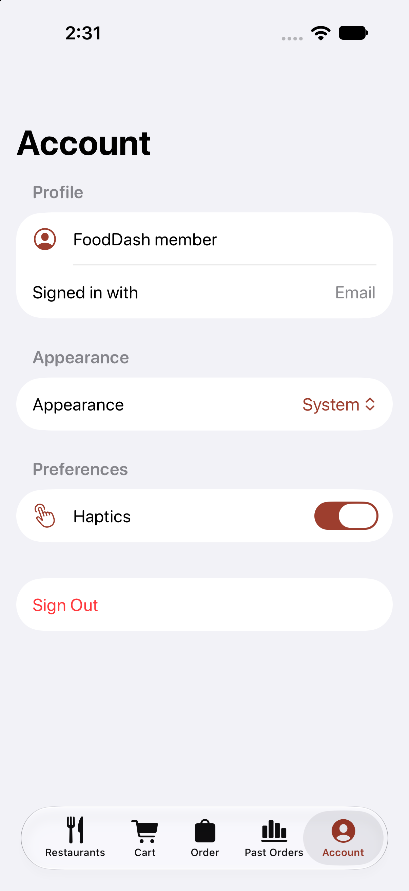 | 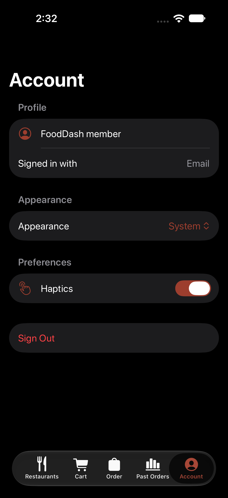 | 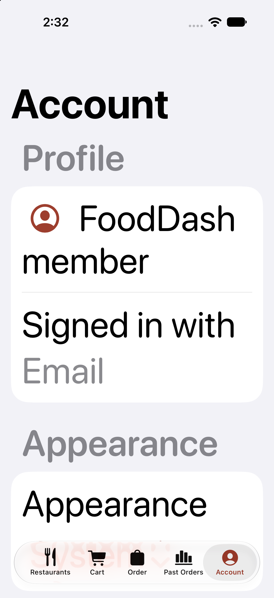 |

The palette check validates generated semantic color assets only. It does not measure every text/background pairing authored by the app, images, gradients or runtime state.

## Capabilities

| Capability | Applied | Module status | Awaiting credentials | Notes |
|---|---|---|---|---|
| Lottie animation (`lottie-animation`) | yes, 2 file(s) | untested | none |  |
| Accessibility baseline (`accessibility-baseline`) | yes, 1 file(s) | untested | none |  |
| Keychain storage (`keychain-storage`) | yes, 1 file(s) | untested | none |  |
| Sign in with Apple (`sign-in-with-apple`) | yes, 1 file(s) | untested | none |  |
| Email and password sign-in (Supabase Auth REST) (`email-password-auth`) | yes, 1 file(s) | untested | `SUPABASE_URL`, `SUPABASE_ANON_KEY` |  |
| MapKit map with places (`mapkit-map`) | yes, 1 file(s) | untested | none |  |
| Location (when in use) (`location-services`) | yes, 1 file(s) | untested | none |  |
| HTTP client (URLSession) (`url-session-networking`) | yes, 1 file(s) | untested | none |  |
| Your REST API (`rest-api-client`) | yes, 1 file(s) | untested | `API_BASE_URL` |  |
| SwiftData local persistence (`swiftdata`) | yes, 1 file(s) | untested | none |  |
| StoreKit 2 subscriptions and paywall (`storekit2-paywall`) | yes, 2 file(s) | untested | none | Product ids are placeholders (<bundle id>.premium.monthly and .yearly) with placeholder prices; create matching products in App Store Connect before release. |
| Live Activity (`live-activity`) | yes, 3 file(s) | untested | none | Updates are local (pushType nil). Remote updates need an APNs key and a server; see the push-notifications catalog entry. |
| Local notifications and reminders (`local-notifications`) | yes, 1 file(s) | untested | none |  |
| Swift Charts dashboard (`swift-charts-dashboard`) | yes, 1 file(s) | untested | none |  |
| Haptic feedback (`haptics`) | yes, 1 file(s) | untested | none |  |
| Appearance setting (light, dark, system) (`appearance-settings`) | yes, 1 file(s) | untested | none |  |
| Brand colors (asset catalog) (`color-assets`) | yes, 5 file(s) | untested | none | Applied the Market Table palette from the app plan; generated semantic assets match it and text colors are adjusted for contrast. |
| Privacy manifest (`privacy-manifest`) | yes, 1 file(s) | untested | none |  |
| SwiftUI design system and components (`design-system`) | yes, 2 file(s) | verified | none |  |
| App icon (rendered from SVG layers, Icon Composer ready) (`app-icon`) | yes, 5 file(s) | untested | none | Generated editable placeholder icon layers using the approved Market Table plan palette; replace the geometry with brand artwork when available. |
| Launch screen and animated splash (`launch-screen`) | yes, 6 file(s) | untested | none | Generated a static launch screen using the approved Market Table plan palette; replace LaunchLogo with the brand mark. |

Applied capabilities compiled as part of this app's successful build.

Requested but not built:

- `websocket-realtime`: Listed in the catalog (status planned) but no module is implemented yet.

## Builds

| Cycle | Attempt | Result | Errors | Warnings | Time |
|---|---|---|---|---|---|
| 2 | 1 | success | 0 | 1 | 17.6 s |

## Needs your accounts or money

- `SUPABASE_URL` for Email and password sign-in (Supabase Auth REST) (add it to `.env`, then rebuild): https://supabase.com/dashboard: Project Settings > API
- `SUPABASE_ANON_KEY` for Email and password sign-in (Supabase Auth REST) (add it to `.env`, then rebuild): https://supabase.com/dashboard: Project Settings > API
- `API_BASE_URL` for Your REST API (add it to `.env`, then rebuild): Your server or hosting provider
- `WEBSOCKET_URL` for WebSocket realtime updates (add it to `.env`, then rebuild): see catalog
- Apple Developer Program membership (needed to distribute; not needed for simulator builds) (sign-in-with-apple, storekit2-paywall): $99.00 per year
- email-password-auth: usage-based, Supabase has a free tier and paid plans; check current limits on its pricing page
- rest-api-client: usage-based, The client is free; hosting your API is billed by your provider

Running on a physical iPhone, TestFlight or the App Store requires your own Apple Developer Program membership and signing team; the agent builds unsigned for the simulator only.

## Next

1. Fill in `.env` from `.env.example`, then rebuild so the placeholder keys are replaced.
2. Capabilities listed as not built need a module in `capabilities/` before the agent can add them.
3. Ask for changes with `/ios-build --refine "<change>"`.
4. Open `FoodDash.xcodeproj` in Xcode to edit and run it yourself.

## Progress log

```text
17:00:41 [preflight] Missing: macos (Run the agent on a Mac with Xcode installed.); xcode (Install Xcode from the Mac App Store, open it once to finish setup, then run `sudo xcode-select -s /Applications/Xcode.app`.); simulator-sdk (In Xcode, open Settings > Components and install an iOS platform, or run `xcodebuild -downloadPlatform iOS`.); simulator (In Xcode, open Window > Devices and Simulators and add an iPhone simulator for the installed iOS runtime.)
17:00:41 [planning] Planning screens, data model and capabilities.
17:00:58 [planning] Plan written: 9 screens, 4 models, 20 capabilities (1 not available).
17:00:58 [planning] PLAN.md written (food-delivery/PLAN.md).
17:00:58 [creating] Creating FoodDash (com.example.fooddash, iOS 17.0).
17:00:58 [capabilities] Applying capability Launch screen and animated splash (untested).
17:00:58 [capabilities] Applying capability Lottie animation (untested).
17:00:58 [capabilities] Applying capability Accessibility baseline (untested).
17:00:58 [capabilities] Applying capability Keychain storage (untested).
17:00:58 [capabilities] Applying capability Sign in with Apple (untested).
17:00:58 [capabilities] Applying capability Email and password sign-in (Supabase Auth REST) (untested).
17:00:58 [capabilities] Applying capability MapKit map with places (untested).
17:00:58 [capabilities] Applying capability Location (when in use) (untested).
17:00:58 [capabilities] Applying capability HTTP client (URLSession) (untested).
17:00:58 [capabilities] Applying capability Your REST API (untested).
17:00:58 [capabilities] Applying capability SwiftData local persistence (untested).
17:00:58 [capabilities] Applying capability StoreKit 2 subscriptions and paywall (untested).
17:00:58 [capabilities] Applying capability Live Activity (untested).
17:00:58 [capabilities] Applying capability Local notifications and reminders (untested).
17:00:58 [capabilities] Applying capability Swift Charts dashboard (untested).
17:00:58 [capabilities] Applying capability Haptic feedback (untested).
17:00:58 [capabilities] Applying capability Appearance setting (light, dark, system) (untested).
17:00:58 [capabilities] Applying capability App icon (rendered from SVG layers, Icon Composer ready) (untested).
17:00:58 [capabilities] Applying capability Brand colors (asset catalog) (untested).
17:00:58 [capabilities] Applying capability Privacy manifest (untested).
17:00:58 [capabilities] Skipping websocket-realtime: Listed in the catalog (status planned) but no module is implemented yet.
17:00:58 [generating] Writing SwiftUI code for 9 screens.
17:05:49 [generating] Wrote 26 file(s).
17:05:49 [reporting] Writing RUN_REPORT.md (toolchain missing: xcode, simulator-sdk, simulator).
05:45:49 [planning] Plan written: 9 screens, 4 models, 21 capabilities (1 not available).
05:45:49 [planning] Plan written: 9 screens, 4 models, 21 capabilities (1 not available).
05:45:49 [capabilities] Applying capability SwiftUI design system and components (verified).
05:45:49 [capabilities] Applying capability App icon (rendered from SVG layers, Icon Composer ready) (untested).
05:45:49 [capabilities] Applying capability Launch screen and animated splash (untested).
07:00:56 [generating] Refining: Refresh this example for the 3.9.1 design layer. Follow PLAN.md exactly: use AppTheme tokens and the included design components, apply AppTheme.fontDesign at each screen root, select a distinct hierarchy and layout matching every screen kind, and give the top-level screens polished populated content from the plan sample records. Ensure every model has a SampleData namespace used by previews. In production, preserve persisted/empty behavior; when AgentLaunch.usesSampleData is true, s...
07:00:57 [preflight] Toolchain ready: Xcode 27.0 (27A266a), iPhone 18 Pro (iOS 27.0).
07:11:31 [failed] Claude Code returned HTTP 429 session limit; model refinement stopped before producing changes.
07:12:00 [generating] The plan-driven UI and isolated sample-data changes were completed locally after the provider limit; they were not produced by Claude.
07:11:31 [reporting] Provider returned HTTP 429: You've hit your session limit · resets 4:10am (America/Chicago)
07:19:40 [failed] Resuming the stopped run.
07:19:40 [preflight] Toolchain ready: Xcode 27.0 (27A266a), iPhone 18 Pro (iOS 27.0).
07:19:40 [building] Build attempt 1 of 8.
07:19:58 [building] Build succeeded in 17.6 s.
07:19:58 [launching] Launching in the simulator.
07:20:10 [screenshots] Captured Restaurants (restaurants) in light appearance.
07:20:19 [screenshots] Captured Restaurants (restaurants) in dark appearance.
07:20:29 [screenshots] Captured Restaurants (restaurants) in xxl appearance.
07:20:38 [screenshots] Captured Cart (cart) in light appearance.
07:20:48 [screenshots] Captured Cart (cart) in dark appearance.
07:20:57 [screenshots] Captured Cart (cart) in xxl appearance.
07:21:07 [screenshots] Captured Order Status (order-status) in light appearance.
07:21:16 [screenshots] Captured Order Status (order-status) in dark appearance.
07:21:26 [screenshots] Captured Order Status (order-status) in xxl appearance.
07:21:36 [screenshots] Captured Past Orders (dashboard) in light appearance.
07:21:45 [screenshots] Captured Past Orders (dashboard) in dark appearance.
07:21:55 [screenshots] Captured Past Orders (dashboard) in xxl appearance.
07:22:05 [screenshots] Captured Account (account) in light appearance.
07:22:14 [screenshots] Captured Account (account) in dark appearance.
07:22:23 [screenshots] Captured Account (account) in xxl appearance.
07:22:24 [reporting] Writing RUN_REPORT.md.
07:29:57 [complete] Resuming the stopped run.
07:29:57 [preflight] Toolchain ready: Xcode 27.0 (27A266a), iPhone 18 Pro (iOS 27.0).
07:29:57 [launching] Launching in the simulator.
07:30:07 [screenshots] Captured Restaurants (restaurants) in light appearance.
07:30:16 [screenshots] Captured Restaurants (restaurants) in dark appearance.
07:30:26 [screenshots] Captured Restaurants (restaurants) in xxl appearance.
07:30:35 [screenshots] Captured Cart (cart) in light appearance.
07:30:44 [screenshots] Captured Cart (cart) in dark appearance.
07:30:53 [screenshots] Captured Cart (cart) in xxl appearance.
07:31:03 [screenshots] Captured Order Status (order-status) in light appearance.
07:31:12 [screenshots] Captured Order Status (order-status) in dark appearance.
07:31:21 [screenshots] Captured Order Status (order-status) in xxl appearance.
07:31:30 [screenshots] Captured Past Orders (dashboard) in light appearance.
07:31:40 [screenshots] Captured Past Orders (dashboard) in dark appearance.
07:31:49 [screenshots] Captured Past Orders (dashboard) in xxl appearance.
07:31:58 [screenshots] Captured Account (account) in light appearance.
07:32:07 [screenshots] Captured Account (account) in dark appearance.
07:32:17 [screenshots] Captured Account (account) in xxl appearance.
07:32:17 [reporting] Writing RUN_REPORT.md.
```
