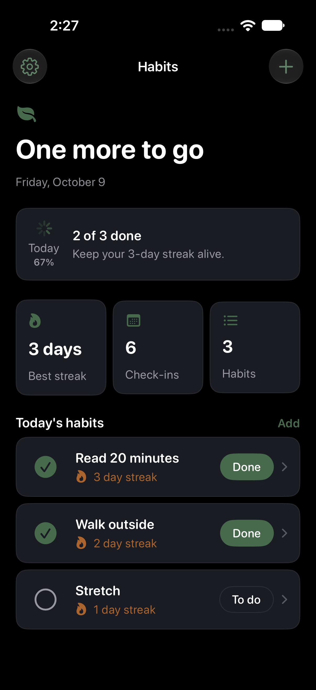
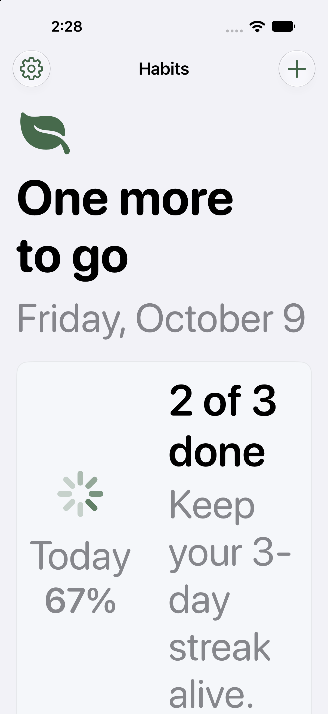

# Run report: Habit Tracker

Request: A simple habit tracker that shows your habits in a list, lets you open any habit to see its details and streak, and mark it done each day. A settings screen lets you switch dark mode on or off. Habits are saved on your device so they remain after you close the app.

## Result

- Status: **complete**
- Elapsed: 9 min; build attempts: 1 (cap 8 per cycle, 2 cycles)
- Last build: succeeded in 24.1 s
- Launched: yes, on iPhone 18 Pro (B4A70BB0-841F-4E38-92DD-7935C63778C2), pid 66703
- Screenshots: 3
- Toolchain: Xcode 27.0 (27A266a); simulator iPhone 18 Pro (iOS 27.0)
- External tool calls logged: 102 (`.ios-agent/tool-log.jsonl`)

## Design evidence

- Direction: optimistic, steady, and restorative; Garden Morning palette; rounded typography; soft shapes; comfortable density; subtle motion.
- Palette on-color contrast: PASS (4.5:1 minimum for all generated light/dark semantic color pairs).
- Generated semantic colors match the approved plan palette: PASS.

| Color | Light | Dark | WCAG AA |
|---|---:|---:|---|
| BrandPrimary | 6.12:1 | 6.12:1 | Pass |
| BrandSecondary | 4.58:1 | 4.58:1 | Pass |
| BrandAccent | 5.09:1 | 5.09:1 | Pass |

### habit-list — light, dark and XXL captured

| Light | Dark | XXL Dynamic Type |
|---|---|---|
|  |  |  |

The palette check validates generated semantic color assets only. It does not measure every text/background pairing authored by the app, images, gradients or runtime state.

## Capabilities

| Capability | Applied | Module status | Awaiting credentials | Notes |
|---|---|---|---|---|
| SwiftData local persistence (`swiftdata`) | yes, 1 file(s) | untested | none |  |
| Appearance setting (light, dark, system) (`appearance-settings`) | yes, 1 file(s) | untested | none |  |
| Accessibility baseline (`accessibility-baseline`) | yes, 1 file(s) | untested | none |  |
| Haptic feedback (`haptics`) | yes, 1 file(s) | untested | none |  |
| Brand colors (asset catalog) (`color-assets`) | yes, 5 file(s) | untested | none | Applied the Garden Morning palette from the app plan; generated semantic assets match it and text colors are adjusted for contrast. |
| SwiftUI design system and components (`design-system`) | yes, 2 file(s) | verified | none |  |
| App icon (rendered from SVG layers, Icon Composer ready) (`app-icon`) | yes, 5 file(s) | untested | none | Generated editable placeholder icon layers using the approved Garden Morning plan palette; replace the geometry with brand artwork when available. |
| Launch screen and animated splash (`launch-screen`) | yes, 6 file(s) | untested | none | Generated a static launch screen using the approved Garden Morning plan palette; replace LaunchLogo with the brand mark. |

Applied capabilities compiled as part of this app's successful build.

## Builds

| Cycle | Attempt | Result | Errors | Warnings | Time |
|---|---|---|---|---|---|
| 2 | 1 | success | 0 | 0 | 24.1 s |

## Needs your accounts or money

Nothing. The app runs in the simulator without accounts.

Running on a physical iPhone, TestFlight or the App Store requires your own Apple Developer Program membership and signing team; the agent builds unsigned for the simulator only.

## Next

1. Ask for changes with `/ios-build --refine "<change>"`.
2. Open `HabitTracker.xcodeproj` in Xcode to edit and run it yourself.

## Progress log

```text
09:29:56 [preflight] Missing: macos (Run the agent on a Mac with Xcode installed.); xcode (Install Xcode from the Mac App Store, open it once to finish setup, then run `sudo xcode-select -s /Applications/Xcode.app`.); simulator-sdk (In Xcode, open Settings > Components and install an iOS platform, or run `xcodebuild -downloadPlatform iOS`.); simulator (In Xcode, open Window > Devices and Simulators and add an iPhone simulator for the installed iOS runtime.); xcodegen (Install XcodeGen: `brew install xcodegen` (or...
09:29:56 [planning] Planning screens, data model and capabilities.
09:30:06 [planning] Plan written: 3 screens, 1 models, 6 capabilities (1 not available).
09:30:06 [planning] PLAN.md written (habit-tracker/PLAN.md).
09:30:06 [creating] Creating HabitTracker (com.example.habittracker, iOS 17.0).
09:30:06 [capabilities] Applying capability SwiftData local persistence (untested).
09:30:06 [capabilities] Applying capability Appearance setting (light, dark, system) (untested).
09:30:06 [capabilities] Applying capability Accessibility baseline (untested).
09:30:06 [capabilities] Applying capability Haptic feedback (untested).
09:30:06 [capabilities] Applying capability Brand colors (asset catalog) (untested).
09:30:06 [capabilities] Applying capability App icon (rendered from SVG layers, Icon Composer ready) (untested).
09:30:06 [capabilities] Skipping sf-symbols: Listed in the catalog (status planned) but no module is implemented yet.
09:30:06 [capabilities] XcodeGen did not generate the project: xcodegen could not start: spawn xcodegen ENOENT
09:30:06 [generating] Writing SwiftUI code for 3 screens.
09:31:18 [generating] Wrote 11 file(s).
09:31:18 [reporting] Writing RUN_REPORT.md (toolchain missing: xcode, simulator-sdk, simulator, xcodegen).
05:45:49 [planning] Plan written: 3 screens, 1 models, 8 capabilities (0 not available).
05:45:49 [planning] Plan written: 3 screens, 1 models, 8 capabilities (0 not available).
05:45:49 [capabilities] Applying capability SwiftUI design system and components (verified).
05:45:49 [capabilities] Applying capability App icon (rendered from SVG layers, Icon Composer ready) (untested).
05:45:49 [capabilities] Applying capability Launch screen and animated splash (untested).
05:45:56 [generating] Refining: Refresh this example for the 3.9.1 design layer. Follow PLAN.md exactly: use AppTheme tokens and the included design components, apply AppTheme.fontDesign at each screen root, select a distinct hierarchy and layout matching every screen kind, and give the top-level screens polished populated content from the plan sample records. Ensure every model has a SampleData namespace used by previews. In production, preserve persisted/empty behavior; when AgentLaunch.usesSampleData is true, s...
05:45:57 [preflight] Toolchain ready: Xcode 27.0 (27A266a), iPhone 18 Pro (iOS 27.0).
05:50:55 [generating] Refinement wrote 11 file(s).
05:50:55 [building] Build attempt 1 of 8.
05:51:20 [building] Build succeeded in 24.1 s.
05:51:20 [launching] Launching in the simulator.
05:52:37 [screenshots] Captured Habits (habit-list) in light appearance.
05:52:46 [screenshots] Captured Habits (habit-list) in dark appearance.
05:52:54 [screenshots] Captured Habits (habit-list) in xxl appearance.
05:52:55 [reporting] Writing RUN_REPORT.md.
07:16:47 [complete] Resuming the stopped run.
07:16:47 [preflight] Toolchain ready: Xcode 27.0 (27A266a), iPhone 18 Pro (iOS 27.0).
07:16:47 [launching] Launching in the simulator.
07:16:58 [screenshots] Captured Habits (habit-list) in light appearance.
07:17:08 [screenshots] Captured Habits (habit-list) in dark appearance.
07:17:17 [screenshots] Captured Habits (habit-list) in xxl appearance.
07:17:17 [reporting] Writing RUN_REPORT.md.
07:27:33 [complete] Resuming the stopped run.
07:27:34 [preflight] Toolchain ready: Xcode 27.0 (27A266a), iPhone 18 Pro (iOS 27.0).
07:27:34 [launching] Launching in the simulator.
07:27:45 [screenshots] Captured Habits (habit-list) in light appearance.
07:27:55 [screenshots] Captured Habits (habit-list) in dark appearance.
07:28:04 [screenshots] Captured Habits (habit-list) in xxl appearance.
07:28:04 [reporting] Writing RUN_REPORT.md.
```
