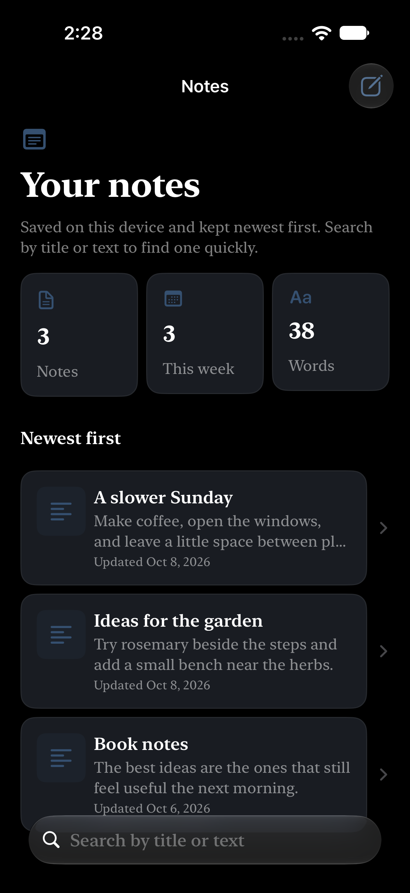
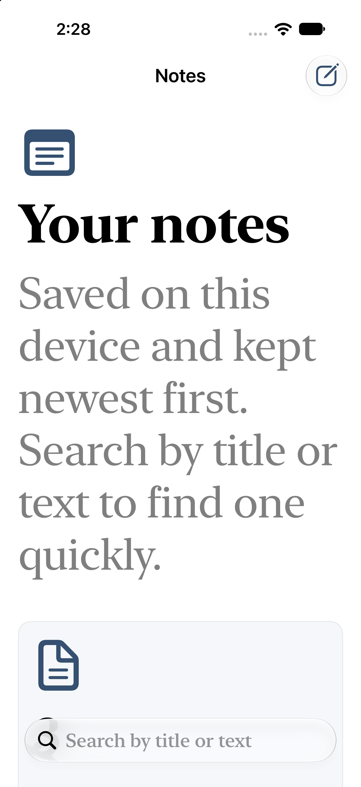

# Run report: Quick Notes

Request: A simple notes app that saves your notes on the device so they are still there after you close the app. You can search all notes by title or text and write new notes or edit existing ones on a dedicated compose screen.

## Result

- Status: **complete**
- Elapsed: 52 min; build attempts: 1 (cap 8 per cycle, 2 cycles)
- Last build: succeeded in 22.2 s
- Launched: yes, on iPhone 18 Pro (B4A70BB0-841F-4E38-92DD-7935C63778C2), pid 67110
- Screenshots: 3
- Toolchain: Xcode 27.0 (27A266a); simulator iPhone 18 Pro (iOS 27.0)
- External tool calls logged: 101 (`.ios-agent/tool-log.jsonl`)

## Design evidence

- Direction: quiet, tactile, and editorial; Ink & Paper palette; serif typography; soft shapes; comfortable density; minimal motion.
- Palette on-color contrast: PASS (4.5:1 minimum for all generated light/dark semantic color pairs).
- Generated semantic colors match the approved plan palette: PASS.

| Color | Light | Dark | WCAG AA |
|---|---:|---:|---|
| BrandPrimary | 8.29:1 | 8.29:1 | Pass |
| BrandSecondary | 6.25:1 | 6.25:1 | Pass |
| BrandAccent | 4.67:1 | 4.67:1 | Pass |

### notes-list — light, dark and XXL captured

| Light | Dark | XXL Dynamic Type |
|---|---|---|
|  |  |  |

The palette check validates generated semantic color assets only. It does not measure every text/background pairing authored by the app, images, gradients or runtime state.

## Capabilities

| Capability | Applied | Module status | Awaiting credentials | Notes |
|---|---|---|---|---|
| SwiftData local persistence (`swiftdata`) | yes, 1 file(s) | untested | none |  |
| Accessibility baseline (`accessibility-baseline`) | yes, 1 file(s) | untested | none |  |
| Haptic feedback (`haptics`) | yes, 1 file(s) | untested | none |  |
| Share sheet (`share-sheet`) | yes, 1 file(s) | untested | none |  |
| Brand colors (asset catalog) (`color-assets`) | yes, 5 file(s) | untested | none | Applied the Ink & Paper palette from the app plan; generated semantic assets match it and text colors are adjusted for contrast. |
| SwiftUI design system and components (`design-system`) | yes, 2 file(s) | verified | none |  |
| App icon (rendered from SVG layers, Icon Composer ready) (`app-icon`) | yes, 5 file(s) | untested | none | Generated editable placeholder icon layers using the approved Ink & Paper plan palette; replace the geometry with brand artwork when available. |
| Launch screen and animated splash (`launch-screen`) | yes, 6 file(s) | untested | none | Generated a static launch screen using the approved Ink & Paper plan palette; replace LaunchLogo with the brand mark. |

Applied capabilities compiled as part of this app's successful build.

## Builds

| Cycle | Attempt | Result | Errors | Warnings | Time |
|---|---|---|---|---|---|
| 2 | 1 | success | 0 | 0 | 22.2 s |

## Needs your accounts or money

Nothing. The app runs in the simulator without accounts.

Running on a physical iPhone, TestFlight or the App Store requires your own Apple Developer Program membership and signing team; the agent builds unsigned for the simulator only.

## Next

1. Ask for changes with `/ios-build --refine "<change>"`.
2. Open `QuickNotes.xcodeproj` in Xcode to edit and run it yourself.

## Progress log

```text
16:54:03 [preflight] Missing: macos (Run the agent on a Mac with Xcode installed.); xcode (Install Xcode from the Mac App Store, open it once to finish setup, then run `sudo xcode-select -s /Applications/Xcode.app`.); simulator-sdk (In Xcode, open Settings > Components and install an iOS platform, or run `xcodebuild -downloadPlatform iOS`.); simulator (In Xcode, open Window > Devices and Simulators and add an iPhone simulator for the installed iOS runtime.)
16:54:03 [planning] Planning screens, data model and capabilities.
16:54:14 [planning] Plan written: 3 screens, 1 models, 6 capabilities (1 not available).
16:54:14 [planning] PLAN.md written (notes-app/PLAN.md).
16:54:14 [creating] Creating QuickNotes (com.example.quicknotes, iOS 17.0).
16:54:14 [capabilities] Applying capability SwiftData local persistence (untested).
16:54:14 [capabilities] Applying capability Accessibility baseline (untested).
16:54:14 [capabilities] Applying capability Haptic feedback (untested).
16:54:14 [capabilities] Applying capability Share sheet (untested).
16:54:14 [capabilities] Applying capability App icon (rendered from SVG layers, Icon Composer ready) (untested).
16:54:14 [capabilities] Applying capability Brand colors (asset catalog) (untested).
16:54:14 [capabilities] Skipping search: Listed in the catalog (status planned) but no module is implemented yet.
16:54:14 [generating] Writing SwiftUI code for 3 screens.
16:55:28 [generating] Wrote 11 file(s).
16:55:28 [reporting] Writing RUN_REPORT.md (toolchain missing: xcode, simulator-sdk, simulator).
05:45:49 [planning] Plan written: 3 screens, 1 models, 8 capabilities (0 not available).
05:45:49 [planning] Plan written: 3 screens, 1 models, 8 capabilities (0 not available).
05:45:49 [capabilities] Applying capability SwiftUI design system and components (verified).
05:45:49 [capabilities] Applying capability App icon (rendered from SVG layers, Icon Composer ready) (untested).
05:45:49 [capabilities] Applying capability Launch screen and animated splash (untested).
06:44:29 [generating] Refining: Refresh this example for the 3.9.1 design layer. Follow PLAN.md exactly: use AppTheme tokens and the included design components, apply AppTheme.fontDesign at each screen root, select a distinct hierarchy and layout matching every screen kind, and give the top-level screens polished populated content from the plan sample records. Ensure every model has a SampleData namespace used by previews. In production, preserve persisted/empty behavior; when AgentLaunch.usesSampleData is true, s...
06:44:30 [preflight] Toolchain ready: Xcode 27.0 (27A266a), iPhone 18 Pro (iOS 27.0).
06:49:58 [generating] Refinement wrote 11 file(s).
06:49:58 [building] Build attempt 1 of 8.
06:50:21 [building] Build succeeded in 22.2 s.
06:50:21 [launching] Launching in the simulator.
06:50:45 [screenshots] Captured Notes (notes-list) in light appearance.
06:50:54 [screenshots] Captured Notes (notes-list) in dark appearance.
06:51:03 [screenshots] Captured Notes (notes-list) in xxl appearance.
06:51:04 [reporting] Writing RUN_REPORT.md.
07:17:22 [complete] Resuming the stopped run.
07:17:22 [preflight] Toolchain ready: Xcode 27.0 (27A266a), iPhone 18 Pro (iOS 27.0).
07:17:22 [launching] Launching in the simulator.
07:17:31 [screenshots] Captured Notes (notes-list) in light appearance.
07:17:41 [screenshots] Captured Notes (notes-list) in dark appearance.
07:17:50 [screenshots] Captured Notes (notes-list) in xxl appearance.
07:17:50 [reporting] Writing RUN_REPORT.md.
07:28:04 [complete] Resuming the stopped run.
07:28:04 [preflight] Toolchain ready: Xcode 27.0 (27A266a), iPhone 18 Pro (iOS 27.0).
07:28:04 [launching] Launching in the simulator.
07:28:14 [screenshots] Captured Notes (notes-list) in light appearance.
07:28:23 [screenshots] Captured Notes (notes-list) in dark appearance.
07:28:33 [screenshots] Captured Notes (notes-list) in xxl appearance.
07:28:33 [reporting] Writing RUN_REPORT.md.
```
