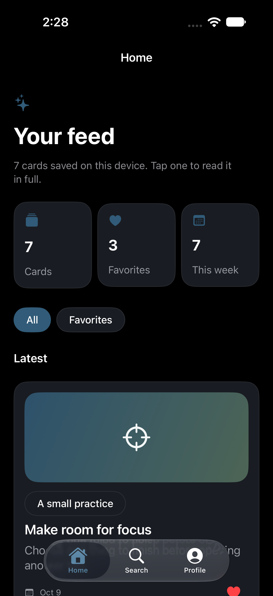
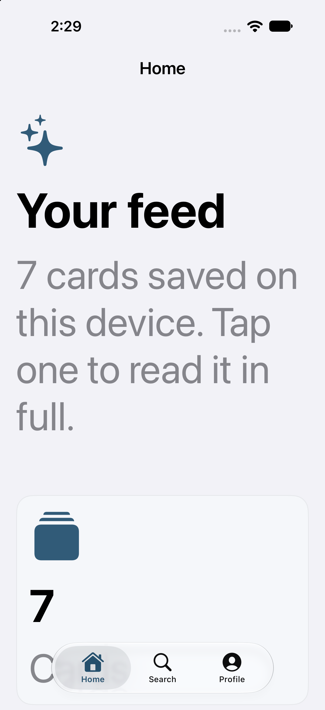
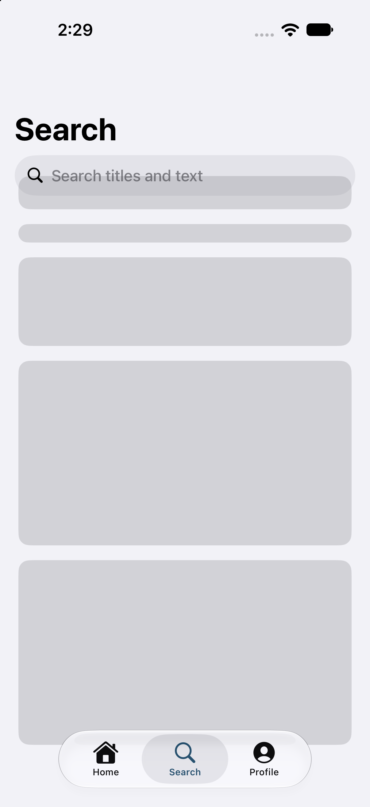
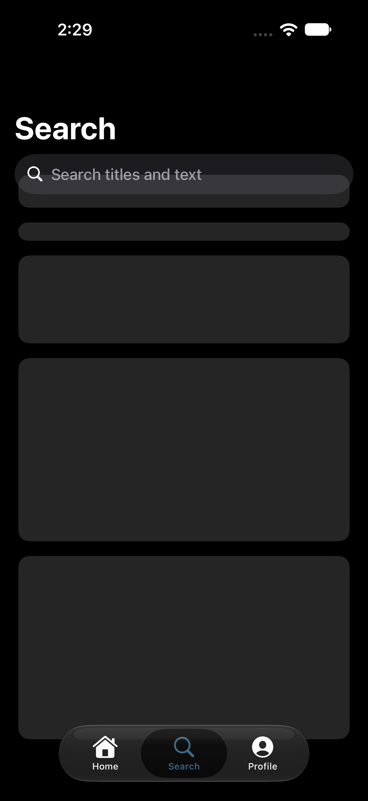
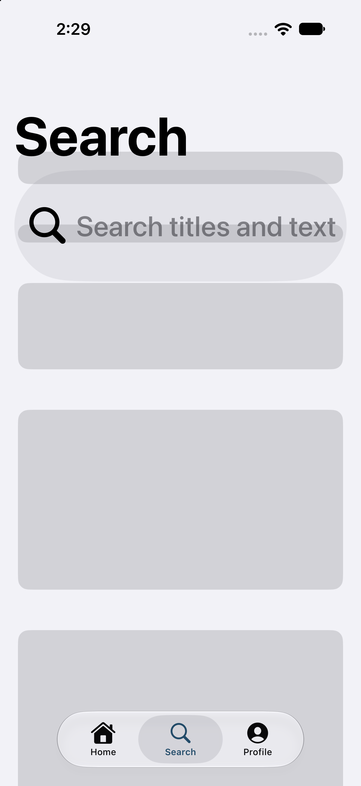
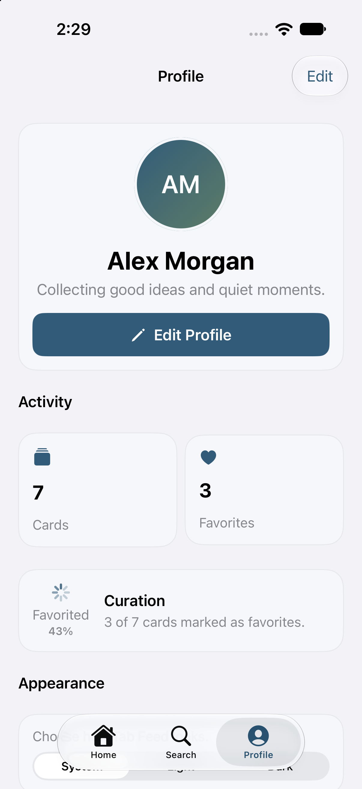
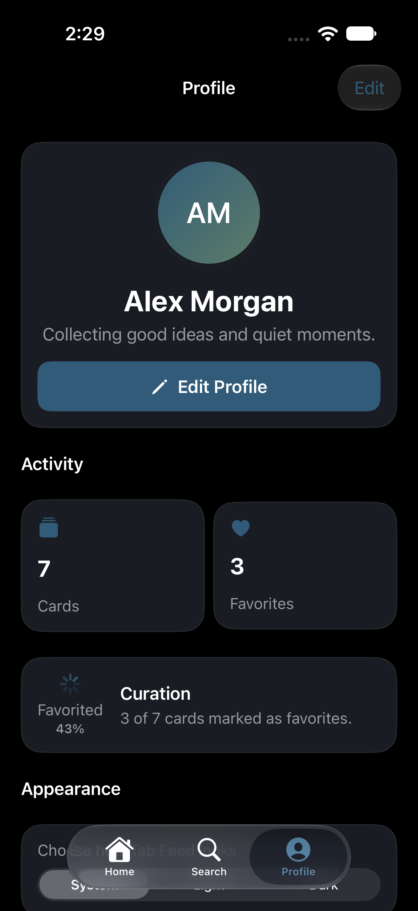
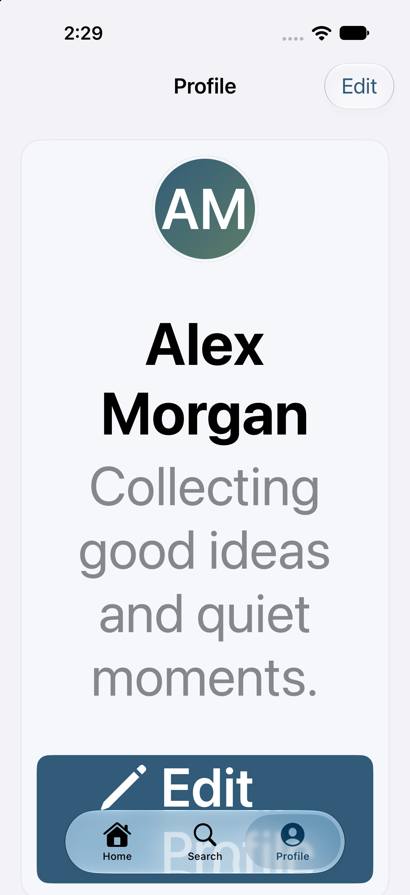

# Run report: Tab Feed

Request: A three-tab app with a Home feed of cards, a Search tab for finding cards, and a Profile tab for the user's details and preferences. Cards and profile data are stored on the device so they remain after relaunch.

## Result

- Status: **complete**
- Elapsed: 46 min; build attempts: 2 (cap 8 per cycle, 2 cycles)
- Last build: succeeded in 17.4 s
- Launched: yes, on iPhone 18 Pro (B4A70BB0-841F-4E38-92DD-7935C63778C2), pid 68073
- Screenshots: 9
- Toolchain: Xcode 27.0 (27A266a); simulator iPhone 18 Pro (iOS 27.0)
- External tool calls logged: 229 (`.ios-agent/tool-log.jsonl`)

## Design evidence

- Direction: curious, bright, and thoughtfully crafted; Blue Hour palette; system typography; rounded shapes; spacious density; subtle motion.
- Palette on-color contrast: PASS (4.5:1 minimum for all generated light/dark semantic color pairs).
- Generated semantic colors match the approved plan palette: PASS.

| Color | Light | Dark | WCAG AA |
|---|---:|---:|---|
| BrandPrimary | 7.25:1 | 7.25:1 | Pass |
| BrandSecondary | 4.56:1 | 4.56:1 | Pass |
| BrandAccent | 4.66:1 | 4.66:1 | Pass |

### home-feed — light, dark and XXL captured

| Light | Dark | XXL Dynamic Type |
|---|---|---|
|  |  |  |

### search — light, dark and XXL captured

| Light | Dark | XXL Dynamic Type |
|---|---|---|
|  |  |  |

### profile — light, dark and XXL captured

| Light | Dark | XXL Dynamic Type |
|---|---|---|
|  |  |  |

The palette check validates generated semantic color assets only. It does not measure every text/background pairing authored by the app, images, gradients or runtime state.

## Capabilities

| Capability | Applied | Module status | Awaiting credentials | Notes |
|---|---|---|---|---|
| SwiftData local persistence (`swiftdata`) | yes, 1 file(s) | untested | none |  |
| Accessibility baseline (`accessibility-baseline`) | yes, 1 file(s) | untested | none |  |
| Brand colors (asset catalog) (`color-assets`) | yes, 5 file(s) | untested | none | Applied the Blue Hour palette from the app plan; generated semantic assets match it and text colors are adjusted for contrast. |
| Appearance setting (light, dark, system) (`appearance-settings`) | yes, 1 file(s) | untested | none |  |
| Photo picker (`photos-picker`) | yes, 1 file(s) | untested | none |  |
| Share sheet (`share-sheet`) | yes, 1 file(s) | untested | none |  |
| SwiftUI design system and components (`design-system`) | yes, 2 file(s) | verified | none |  |
| App icon (rendered from SVG layers, Icon Composer ready) (`app-icon`) | yes, 5 file(s) | untested | none | Generated editable placeholder icon layers using the approved Blue Hour plan palette; replace the geometry with brand artwork when available. |
| Launch screen and animated splash (`launch-screen`) | yes, 6 file(s) | untested | none | Generated a static launch screen using the approved Blue Hour plan palette; replace LaunchLogo with the brand mark. |

Applied capabilities compiled as part of this app's successful build.

## Builds

| Cycle | Attempt | Result | Errors | Warnings | Time |
|---|---|---|---|---|---|
| 2 | 1 | failed | 2 | 0 | 31.2 s |
| 2 | 2 | success | 0 | 0 | 17.4 s |

## Needs your accounts or money

Nothing. The app runs in the simulator without accounts.

Running on a physical iPhone, TestFlight or the App Store requires your own Apple Developer Program membership and signing team; the agent builds unsigned for the simulator only.

## Next

1. Ask for changes with `/ios-build --refine "<change>"`.
2. Open `TabFeed.xcodeproj` in Xcode to edit and run it yourself.

## Progress log

```text
16:54:03 [preflight] Missing: macos (Run the agent on a Mac with Xcode installed.); xcode (Install Xcode from the Mac App Store, open it once to finish setup, then run `sudo xcode-select -s /Applications/Xcode.app`.); simulator-sdk (In Xcode, open Settings > Components and install an iOS platform, or run `xcodebuild -downloadPlatform iOS`.); simulator (In Xcode, open Window > Devices and Simulators and add an iPhone simulator for the installed iOS runtime.)
16:54:03 [planning] Planning screens, data model and capabilities.
16:54:14 [planning] Plan written: 4 screens, 2 models, 8 capabilities (2 not available).
16:54:14 [planning] PLAN.md written (three-tab-app/PLAN.md).
16:54:14 [creating] Creating TabFeed (com.example.tabfeed, iOS 17.0).
16:54:14 [capabilities] Applying capability SwiftData local persistence (untested).
16:54:14 [capabilities] Applying capability Accessibility baseline (untested).
16:54:14 [capabilities] Applying capability Brand colors (asset catalog) (untested).
16:54:14 [capabilities] Applying capability Appearance setting (light, dark, system) (untested).
16:54:14 [capabilities] Applying capability Photo picker (untested).
16:54:14 [capabilities] Applying capability Share sheet (untested).
16:54:14 [capabilities] Applying capability App icon (rendered from SVG layers, Icon Composer ready) (untested).
16:54:14 [capabilities] Applying capability Launch screen and animated splash (untested).
16:54:14 [capabilities] Skipping search: Listed in the catalog (status planned) but no module is implemented yet.
16:54:14 [capabilities] Skipping sf-symbols: Listed in the catalog (status planned) but no module is implemented yet.
16:54:14 [generating] Writing SwiftUI code for 4 screens.
16:55:28 [generating] Wrote 14 file(s).
16:55:28 [reporting] Writing RUN_REPORT.md (toolchain missing: xcode, simulator-sdk, simulator).
05:45:49 [planning] Plan written: 4 screens, 2 models, 11 capabilities (0 not available).
05:45:49 [planning] Plan written: 4 screens, 2 models, 11 capabilities (0 not available).
05:45:49 [capabilities] Applying capability SwiftUI design system and components (verified).
05:45:49 [capabilities] Applying capability App icon (rendered from SVG layers, Icon Composer ready) (untested).
05:45:49 [capabilities] Applying capability Launch screen and animated splash (untested).
06:51:08 [generating] Refining: Refresh this example for the 3.9.1 design layer. Follow PLAN.md exactly: use AppTheme tokens and the included design components, apply AppTheme.fontDesign at each screen root, select a distinct hierarchy and layout matching every screen kind, and give the top-level screens polished populated content from the plan sample records. Ensure every model has a SampleData namespace used by previews. In production, preserve persisted/empty behavior; when AgentLaunch.usesSampleData is true, s...
06:51:09 [preflight] Toolchain ready: Xcode 27.0 (27A266a), iPhone 18 Pro (iOS 27.0).
06:58:24 [generating] Refinement wrote 15 file(s).
06:58:24 [building] Build attempt 1 of 8.
06:58:56 [fixing] Build failed with 2 error(s); fixing.
06:58:56 [fixing] Fixing 2 error(s) for attempt 2 of 8.
06:59:10 [building] Build attempt 2 of 8.
06:59:28 [building] Build succeeded in 17.4 s.
06:59:28 [launching] Launching in the simulator.
06:59:42 [screenshots] Captured Home (home-feed) in light appearance.
06:59:51 [screenshots] Captured Home (home-feed) in dark appearance.
06:59:58 [screenshots] Captured Home (home-feed) in xxl appearance.
07:00:06 [screenshots] Captured Search (search) in light appearance.
07:00:15 [screenshots] Captured Search (search) in dark appearance.
07:00:23 [screenshots] Captured Search (search) in xxl appearance.
07:00:31 [screenshots] Captured Profile (profile) in light appearance.
07:00:38 [screenshots] Captured Profile (profile) in dark appearance.
07:00:45 [screenshots] Captured Profile (profile) in xxl appearance.
07:00:45 [reporting] Writing RUN_REPORT.md.
07:17:53 [complete] Resuming the stopped run.
07:17:54 [preflight] Toolchain ready: Xcode 27.0 (27A266a), iPhone 18 Pro (iOS 27.0).
07:17:54 [launching] Launching in the simulator.
07:18:04 [screenshots] Captured Home (home-feed) in light appearance.
07:18:13 [screenshots] Captured Home (home-feed) in dark appearance.
07:18:22 [screenshots] Captured Home (home-feed) in xxl appearance.
07:18:32 [screenshots] Captured Search (search) in light appearance.
07:18:41 [screenshots] Captured Search (search) in dark appearance.
07:18:50 [screenshots] Captured Search (search) in xxl appearance.
07:18:59 [screenshots] Captured Profile (profile) in light appearance.
07:19:09 [screenshots] Captured Profile (profile) in dark appearance.
07:19:18 [screenshots] Captured Profile (profile) in xxl appearance.
07:19:18 [reporting] Writing RUN_REPORT.md.
07:28:33 [complete] Resuming the stopped run.
07:28:33 [preflight] Toolchain ready: Xcode 27.0 (27A266a), iPhone 18 Pro (iOS 27.0).
07:28:33 [launching] Launching in the simulator.
07:28:43 [screenshots] Captured Home (home-feed) in light appearance.
07:28:52 [screenshots] Captured Home (home-feed) in dark appearance.
07:29:01 [screenshots] Captured Home (home-feed) in xxl appearance.
07:29:11 [screenshots] Captured Search (search) in light appearance.
07:29:20 [screenshots] Captured Search (search) in dark appearance.
07:29:29 [screenshots] Captured Search (search) in xxl appearance.
07:29:38 [screenshots] Captured Profile (profile) in light appearance.
07:29:47 [screenshots] Captured Profile (profile) in dark appearance.
07:29:57 [screenshots] Captured Profile (profile) in xxl appearance.
07:29:57 [reporting] Writing RUN_REPORT.md.
```
