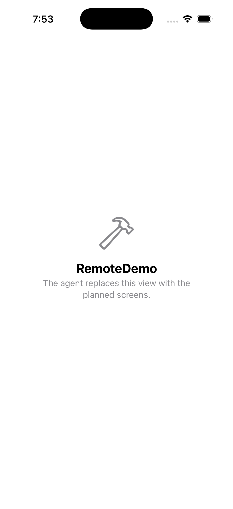
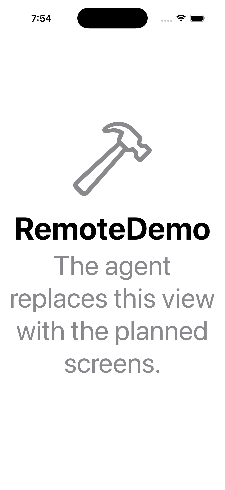

# GitHub-hosted macOS smoke test

A synthetic, one-screen starter app built unsigned and launched on a GitHub-hosted macOS runner on October 9, 2026. This checks remote build/capture plumbing; it is not an app-quality showcase or a benchmark result.

- [Actions run 37901151813](https://github.com/Nagarjuna2997/ios-agent-skill/actions/runs/37901151813)
- [Uploaded synthetic project and workflow](https://github.com/Nagarjuna2997/ios-agent-skill/tree/5119f2cb39b2de138d5664cac8695c8d3820055c)
- Toolkit commit: `267f5a2a2d49df361d435e18be1328d33e16dcf3`
- Runner: `macos-15`; Xcode 26.3 (17C529); iPhone 17 Pro
- Build: succeeded in 19.549 seconds, zero parsed errors/warnings
- Captures: light, dark, XXL; all evidence SHA-256 values checked against the returned manifest
- [Original result manifest](evidence/result.json) and [build log](evidence/.ios-agent/logs/build-1.log)

The first toolchain probe reported no simulator while CoreSimulator started; the returned launch record and PNGs show the device that was subsequently used. That reporting bug was fixed after this run: current code updates the simulator metadata after boot and records the SDK. This original evidence is preserved unchanged.

The GitHub CLI was unavailable on the test client. The live source upload used Git push and artifact retrieval used the connected GitHub API. The production client's GitHub CLI authentication/download and API dispatch/resume paths were tested with fixtures, not in this live run. No provider-driven repair or unit/UI test suite ran on the hosted runner. Compiler-error return and the client repair loop have offline regression tests.

<table><tr><td>Light</td><td>Dark</td><td>XXL</td></tr><tr>
<td></td>
<td></td>
<td></td>
</tr></table>
